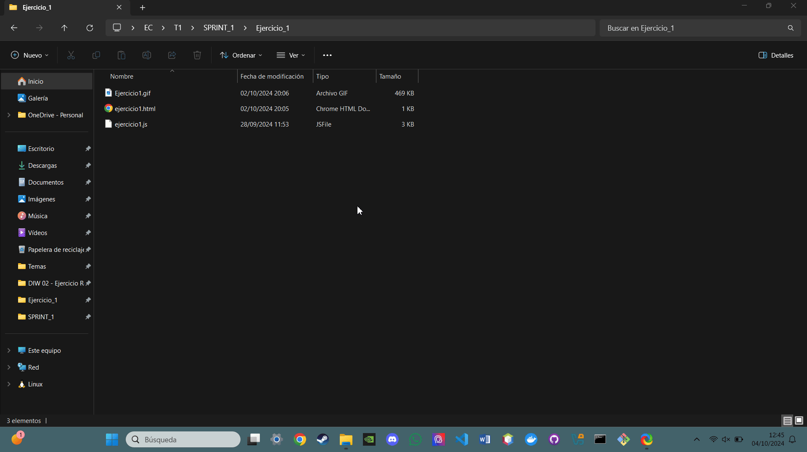

# Ejercicio 1: Cambio de Color con Botón

## Análisis

**Descripción del ejercicio:**  
El ejercicio consiste en crear una página web que contenga un botón etiquetado como "Cambiar color". Al hacer clic en este botón, el color de fondo de la página debe cambiar de manera aleatoria utilizando valores RGB generados por `Math.random()`. El código debe estar dividido en un archivo HTML y otro JS.

## Diseño

**HTML (ejercicio1.html):**  
El archivo HTML contiene la estructura básica de la página web. Dentro del cuerpo de la página (`<body>`), se define un botón con el texto "Cambiar color". Se enlaza un archivo externo JavaScript (`Ejercicio1.js`) que contiene la lógica para cambiar el color de fondo.

**JavaScript (ejercicio1.js):**  

- Se selecciona el botón utilizando su `id` (`colorButton`).
- Se define una función `generateRandomColor()` que genera un color RGB aleatorio, utilizando `Math.random()` para generar valores entre 0 y 255 para los componentes de color rojo (R), verde (G) y azul (B).
- La función `changeBackgroundColor()` llama a `generateRandomColor()` y aplica el color generado como el color de fondo de la página utilizando `document.body.style.backgroundColor`.
- Se añade un event listener al botón que ejecuta `changeBackgroundColor()` cada vez que se hace clic en el botón.

**Bibliografía general usada para hacer el ejercicio:**  

- Generación de colores aleatorios con JavaScript: Se investigaron ejemplos sobre cómo generar valores RGB aleatorios utilizando `Math.random()`.
- Uso de `addEventListener` para agregar interactividad a elementos HTML en eventos de clic.

Todo el contenido del HTML y JS ha sido dado por ayuda de ChatGPT:

- ¿Cómo puedo generar un color RGB aleatorio en JavaScript base en un boton en HTML?
- ¿Cómo asigno el boton a Math.Random?
- ¿Cómo se puede añadir un evento de clic a un botón en JavaScript?

## Prueba

**Descripción de la demostración:**  
En el GIF de demostración se verá cómo, al hacer clic repetidamente en el botón "Cambiar color", el color de fondo de la página cambia a diferentes colores aleatorios cada vez. Solo el color de fondo cambia, y el contenido de la página (el botón) permanece igual.

### Demostración

---

# Ejercicio 2: Calculadora de Área

## Análisis

**Descripción del ejercicio:**  
El ejercicio consiste en crear una página web que permita calcular el área de un rectángulo. La página debe tener dos campos de entrada para introducir el ancho y el alto del rectángulo, y un botón etiquetado "Calcular Área". Al hacer clic en el botón, se debe calcular el área del rectángulo (ancho x alto) y mostrar el resultado en un elemento `
` en la página. Si los valores no son válidos, se debe mostrar un mensaje de error.

## Diseño

**HTML (ejercicio2.html):**  
La página tiene dos campos de entrada de tipo `number` para el ancho (`width`) y el alto (`height`), ambos con un valor mínimo de 0. También incluye un botón para realizar el cálculo y un párrafo donde se mostrará el resultado del área.

**JavaScript (ejercicio2.js):**  

- Se captura el evento de clic en el botón mediante `addEventListener`.
- Se obtienen los valores del ancho y del alto desde los campos de entrada.
- Se verifica que los valores sean números y que sean mayores o iguales a 0.
- Si los valores son válidos, se calcula el área multiplicando el ancho por el alto y se muestra el resultado en el párrafo con `id="result"`.
- Si los valores no son válidos, se muestra un mensaje de error en el mismo párrafo.

**Bibliografía general usada para hacer el ejercicio:**  

- Cálculos matemáticos y operaciones en JavaScript.
- Uso de eventos `click` en JavaScript para interactividad.
- Validación de valores de entradas numéricas en JavaScript.

Todo el contenido del HTML y JS ha sido dado por ayuda de ChatGPT:

- ¿Cómo asigno el valor de dos campos de un HTML a un JS para multiplicar su valor con un boton?
- ¿Cómo se puede mostrar el resultado?

## Prueba

**Descripción de la demostración:**  
En el GIF de demostración se mostrará cómo, al rellenar ambos campos de entrada con los valores `2` para el ancho y `2` para el alto, se mostrará un área de `4`. Luego, al cambiar los valores a `2` para el ancho y `9` para el alto, se mostrará un área de `18`.

### Demostración

---

# Ejercicio 3: Listado Dinámico

## Análisis

**Descripción del ejercicio:**  
El ejercicio consiste en crear una página web con un campo de entrada de texto y un botón etiquetado "Añadir a la lista". Al escribir algo en el campo de entrada y hacer clic en el botón, el contenido del campo debe agregarse a una lista vacía como un nuevo ítem (`<li>`). Se debe utilizar `createElement()` para crear los nuevos elementos y `appendChild()` para añadirlos a la lista.

## Diseño

**HTML (ejercicio3.html):**  
La página web tiene un campo de entrada de texto y un botón para agregar ítems a la lista. Al inicio, la lista (`<ul>`) está vacía y se llenará dinámicamente conforme el usuario agregue elementos. La estructura es sencilla, incluyendo solo un título, el campo de entrada, el botón, y la lista vacía.

**JavaScript (ejercicio3.js):**  

- Se capturan los elementos del DOM correspondientes al campo de entrada, el botón y la lista vacía.
- Se añade un event listener al botón para que al hacer clic, se obtenga el valor del campo de entrada.
- Si el valor no está vacío, se crea un nuevo elemento `<li>`, se le asigna el valor ingresado como su contenido de texto, y se añade este nuevo ítem a la lista utilizando `appendChild()`.
- Si el campo de entrada está vacío, se muestra una alerta pidiendo que se ingrese un texto válido.
- Después de añadir un ítem a la lista, el campo de entrada se limpia para permitir ingresar nuevos valores.

**Bibliografía general usada para hacer el ejercicio:**  

- Uso de `createElement()` y `appendChild()` para manipular el DOM en JavaScript.
- Eventos de clic (`click`) en JavaScript.
- Validación de entradas de texto en JavaScript.

Todo el contenido del HTML y JS ha sido dado por ayuda de ChatGPT:

- ¿Cómo puedo agregar textos a una lista de HTML a JS?
- ¿Cómo capturO el valor de un campo de entrada de texto en JavaScript?
- ¿Cómo limpiar el campo de entrada después de agregar un valor a la lista?

## Prueba

**Descripción de la demostración:**  
En el GIF de demostración, se verá cómo se añaden tres elementos a la lista. Primero, el usuario escribe el texto "Elemento 1" en el campo de entrada, hace clic en el botón, y el ítem aparece en la lista. Luego, repite el proceso con "Elemento 2" y "Elemento 3", mostrando cómo se van agregando nuevos ítems a la lista.

### Demostración

---

# Ejercicio 4: Hover y Estilo Dinámico

## Análisis

**Descripción del ejercicio:**  
El ejercicio consiste en diseñar una página web con varios elementos `div`, cada uno con un texto diferente. Al pasar el ratón sobre uno de los `divs`, el color de fondo debe cambiar a azul y el color del texto a blanco. Al mover el ratón fuera del `div`, los estilos originales deben restaurarse. Se recomienda el uso de los eventos `mouseover` y `mouseout`.

## Diseño

**HTML (ejercicio4.html):**  
La página contiene tres elementos `div`, cada uno con una clase llamada `hover-box` y un texto diferente. La funcionalidad de cambiar el color al pasar el ratón se implementa mediante JavaScript. El archivo HTML es simple, con un título y los `divs` que cambiarán de estilo al interactuar con el ratón.

**JavaScript (ejercicio4.js):**  

- Se seleccionan todos los elementos `div` con la clase `hover-box` usando `querySelectorAll`.
- Se añade un evento `mouseover` a cada `div` para que cuando el ratón pase sobre el elemento, el color de fondo cambie a azul y el color del texto a blanco.
- Se añade un evento `mouseout` para restaurar los estilos originales cuando el ratón sale del `div`, dejando los estilos en blanco para que vuelvan a sus valores por defecto.
  
**Bibliografía general usada para hacer el ejercicio:**  

- Manipulación de estilos dinámicamente usando JavaScript.
- Eventos `mouseover` y `mouseout` en JavaScript para interactuar con el ratón sobre elementos de la página.
  
Todo el contenido del HTML y JS ha sido dado por ayuda de ChatGPT:

- ¿Cómo puedo cambiar el color de fondo de un elemento con JavaScript al pasar el ratón sobre él?
- ¿Cómo quito el color de un elemento con JavaScript cuando el ratón deja de estar sobre él?

## Prueba

**Descripción de la demostración:**  
En el GIF de demostración, se verá cómo al pasar el ratón sobre cada uno de los `divs`, el color de fondo cambia a azul y el texto a blanco. Al retirar el ratón, los estilos de los `divs` vuelven a sus valores originales.

### Demostración

---

# Ejercicio 5: Detección de Clics y Generación de XPath

## Análisis

**Descripción del ejercicio:**  
En este ejercicio, se desarrolla una página web que detecta cualquier clic en los elementos de la página, incluyendo un botón en un `iframe`. Al hacer clic, se genera y muestra el XPath único del elemento seleccionado dentro de una sección de la página.

### Especificaciones

1. **Detección de Clics:**
   - Se añade un `eventListener` que detecta clics en el documento.
   - Al detectar el clic, se captura el elemento clicado con `event.target`.

2. **Generación de XPath:**
   - El XPath único del elemento clicado se genera y se muestra en un `
` con el id `reconocimiento`.

## Diseño

**HTML (ejercicio5.html):**  

- Contiene un botón principal (`Botón Principal`) y un `iframe` que incluye otro botón (`Botón Iframe`).
- Se añade un párrafo (`
`) donde se mostrará el XPath del elemento clicado.

**JavaScript (ejercicio4.js):**  

El archivo de JavaScript incluye las siguientes funcionalidades:

- **Función `getXPath(element)`**:
  - Esta función genera el XPath del elemento dado como parámetro.
  - Si el elemento tiene un atributo `id`, genera un XPath absoluto basado en dicho `id`, por ejemplo: `//*[@id='mainButton']`.
  - Si el elemento no tiene `id`, la función recorre su árbol DOM ascendiendo a los nodos superiores (hasta llegar al `body`), para crear un XPath basado en la estructura y la posición relativa del elemento en el documento.
  
- **Función `handleClick(event)`**:
  - Esta función actúa como manejadora del evento de clic.
  - Captura el elemento clicado utilizando `event.target` y luego llama a la función `getXPath` para generar el XPath correspondiente.
  - Una vez que obtiene el XPath, lo pasa a la función `updateOutput` para mostrarlo en la página.

- **Función `updateOutput(xpath)`**:
  - Esta función toma el XPath generado y lo muestra en el elemento HTML con `id="reconocimiento"`.
  - Básicamente, actualiza el contenido del párrafo donde se presentará el XPath generado.

- **Función `initialize()`**:
  - Esta función inicializa la lógica del script y agrega un `eventListener` que detecta todos los clics que ocurren en el documento.
  - Cuando el documento carga, llama a esta función para asegurarse de que los eventos se gestionen correctamente desde el inicio.

**Flujo del código**

1. Cuando un usuario hace clic en cualquier parte de la página, se ejecuta la función `handleClick`, que identifica el elemento clicado usando `event.target`.
2. Se genera el XPath del elemento usando `getXPath` y luego se muestra en el párrafo `
` mediante `updateOutput`.
3. Si se hace clic en el botón dentro del `iframe`, también se captura ese clic y su XPath se genera y muestra.

**Bibliografía general usada para hacer el ejercicio:**  
  
Todo el contenido del HTML y JS ha sido dado por ayuda de ChatGPT:

- ¿Dentro de este HTML se esta definiendo otro HTML?
- ¿Como deberia definir el boton iframe en un codigo JS?
- ¿Como puedo contrar elementos XPATH de un HTML?
- ¿Como los defino en un `
` de HTML?F

## Prueba

**Descripción de la demostración:**  
En el GIF de demostración, se verá como al hacer clic en los elementos visibles y no visibles de la web, mediante el parrafo definido debajo del boton principal podremos encontrar los formatos XPATH que define a cada elemento.

### Demostración

**ANOTACION FINAL**

Debido a que estamos empezando a utilizar JS y es complicado de manejar le he dado una ultima tarea a ChatGPT para aprender mejor lo que esta ocurriendo en cada funcion de cada JS:

- Voy a darte un HTML y un JS, quiero que hagas comentarios definiendo lo que ocurre en cada linea de codigo del JS, solo del JS: `codigo HTML` `codigo JS`.
