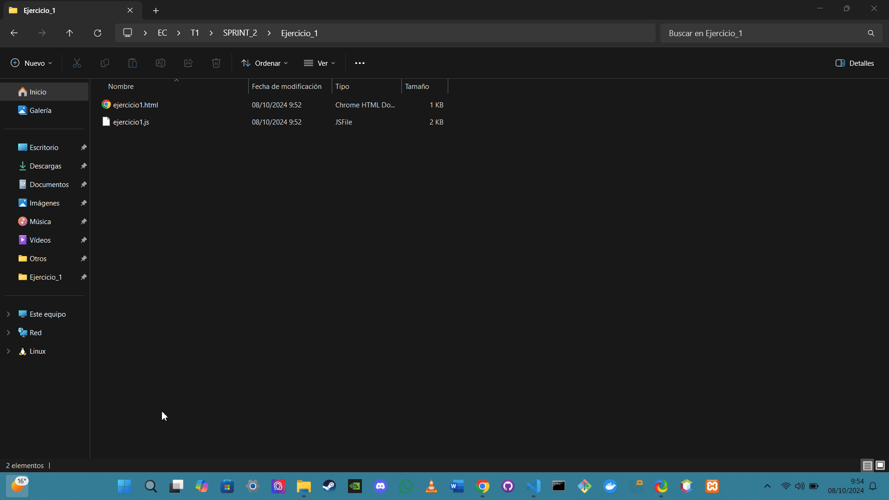
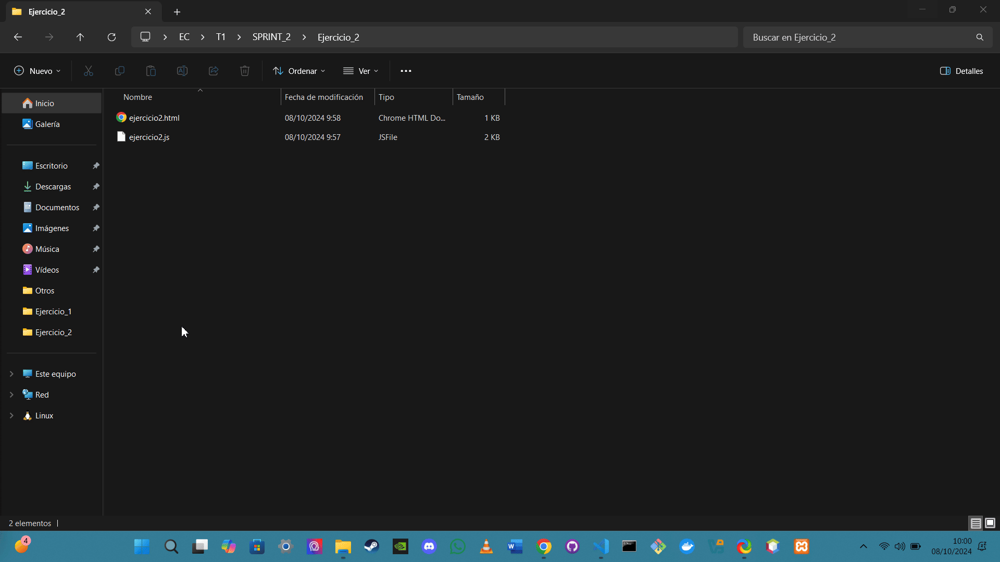
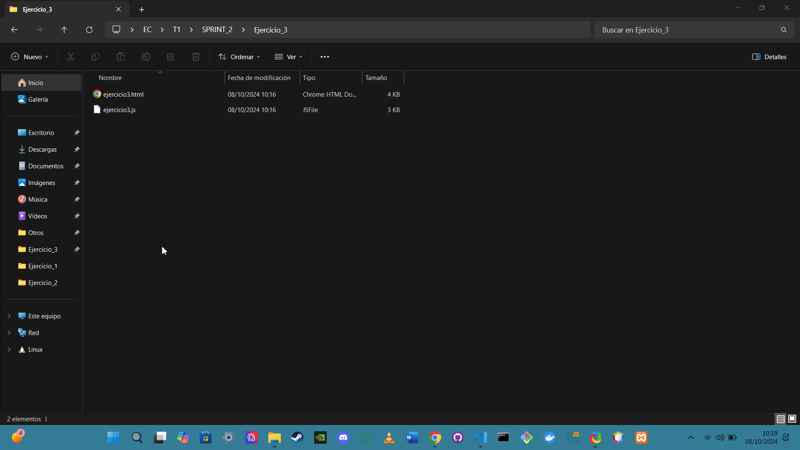
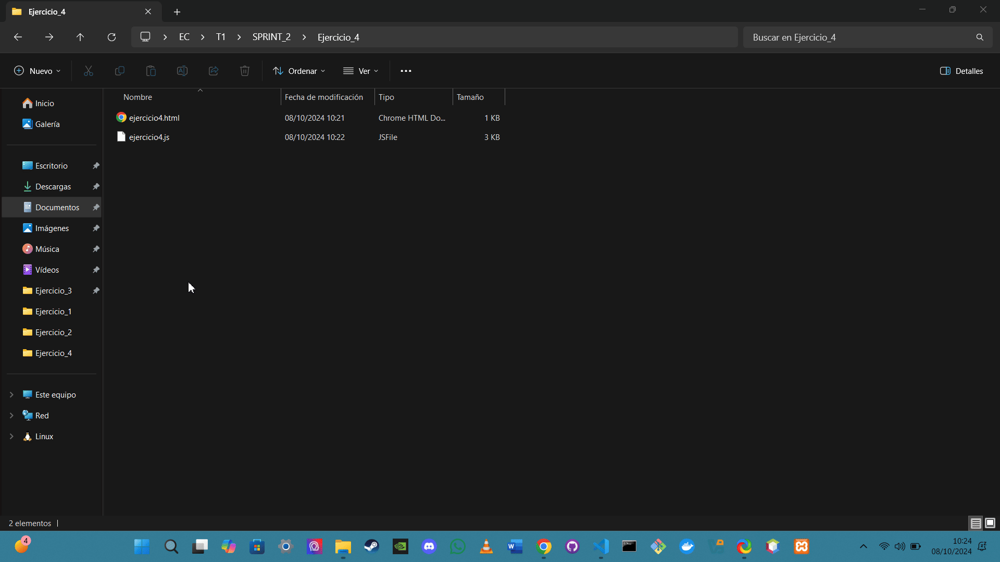
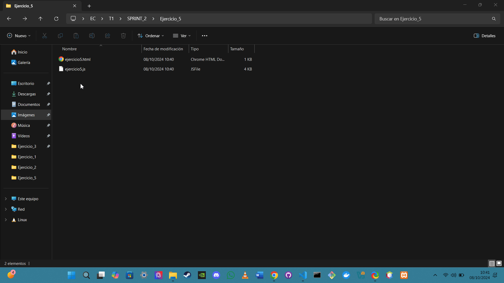

# Ejercicio 1: Temporizador Contrarreloj

## Análisis

**Descripción del ejercicio:**  
Este ejercicio consiste en desarrollar un temporizador que permite al usuario introducir un número de segundos. Al presionar el botón "Iniciar", el temporizador comenzará una cuenta regresiva y mostrará el tiempo restante en la pantalla. Una vez que el tiempo se agote, se mostrará una alerta indicando que el tiempo ha finalizado.

## Diseño

**Descripción de los componentes:**

- **HTML (ejercicio1.html):**  
  - Incluye un encabezado (`h1`) que indica el propósito de la página (Temporizador).
  - Un campo de entrada (`input`) donde el usuario puede introducir el número de segundos que desea que dure la cuenta regresiva.
  - Un botón (`button`) que al ser presionado inicia la cuenta regresiva.
  - Un elemento de tipo `div` que muestra el tiempo restante en segundos.

- **JavaScript (ejercicio1.js):**  
  Este archivo contiene el código que realiza las siguientes funciones:
  - **Obtener elementos del DOM:**  
    - Se obtiene el campo de entrada, el botón y el div que mostrará el tiempo restante mediante sus respectivos IDs.
  - **Iniciar el temporizador:**  
    - Al hacer clic en el botón "Iniciar", se convierte el valor del campo de entrada a un número entero y se valida que sea un número válido y mayor que cero.
    - Se limpia cualquier temporizador previo para evitar conflictos.
    - Se inicia una función que decrece el contador de segundos cada segundo y actualiza el contenido del div con el tiempo restante.
    - Cuando el temporizador llega a cero, se detiene y se muestra una alerta al usuario indicando que el tiempo ha finalizado.

**Bibliografía general usada para hacer el ejercicio:**  
Todo el contenido del HTML y JS ha sido dado por ayuda de ChatGPT:

- (Copy/Paste del ejercicio directamente desde Google Docs)

## Prueba

**Descripción de la demostración:**  
Para probar el temporizador, se debe abrir el archivo HTML en un navegador. El usuario introduce un número de segundos en el campo correspondiente y hace clic en "Iniciar". El tiempo restante se mostrará en el div, y cuando llegue a cero, aparecerá una alerta indicando que el tiempo ha finalizado.

### Demostración

---

# Ejercicio 2: Calculadora Básica

## Análisis

**Descripción del ejercicio:**  
Este ejercicio consiste en crear una calculadora básica que permite al usuario ingresar dos números y seleccionar una operación matemática (suma, resta, multiplicación o división). Al hacer clic en el botón "Calcular", se mostrará el resultado de la operación seleccionada.

## Diseño

**Descripción de los componentes:**

- **HTML (ejercicio2.html):**  
  - Incluye un encabezado (`h1`) que indica que se trata de una calculadora básica.
  - Dos campos de entrada (`input`) donde el usuario puede ingresar los números que desea calcular.
  - Un menú desplegable (`select`) que permite al usuario seleccionar la operación matemática que desea realizar.
  - Un botón (`button`) que, al ser presionado, ejecuta el cálculo.
  - Un elemento de tipo `div` que mostrará el resultado de la operación.

- **JavaScript (ejercicio2.js):**  
  Este archivo contiene el código que realiza las siguientes funciones:
  - **Obtener elementos del DOM:**  
    - Se obtienen los campos de entrada, el menú desplegable y el div para mostrar el resultado mediante sus respectivos IDs.
  - **Realizar el cálculo:**  
    - Al hacer clic en el botón "Calcular", se obtienen los valores de los campos de entrada y se verifica que sean números válidos.
    - Dependiendo de la operación seleccionada, se ejecuta el cálculo correspondiente.
    - En caso de que el usuario intente dividir por cero, se muestra el mensaje "INDEFINIDO".
    - Finalmente, se actualiza el div de resultado con el valor calculado.

**Bibliografía general usada para hacer el ejercicio:**  
Todo el contenido del HTML y JS ha sido dado por ayuda de ChatGPT:

- (Copy/Paste del ejercicio directamente desde Google Docs)

## Prueba

**Descripción de la demostración:**  
Para probar la calculadora, se debe abrir el archivo HTML en un navegador. El usuario introduce dos números, selecciona la operación deseada en el menú desplegable y hace clic en "Calcular". El resultado de la operación se mostrará en el div correspondiente.

### Demostración

---

# Ejercicio 3: Encuesta de Empresas de Videojuegos

## Análisis

**Descripción del ejercicio:**  
Este ejercicio permite a los usuarios votar por su empresa de videojuegos favorita entre varias opciones. La encuesta utiliza botones de opción (radio buttons) para la selección y muestra el número de votos y un gráfico de barras que refleja la cantidad de votos por cada empresa.

## Diseño

**Descripción de los componentes:**

- **HTML (ejercicio3.html):**  
  - Contiene un encabezado (`h1`) que presenta la encuesta.
  - Un formulario (`form`) que incluye una tabla con opciones de votación (radio buttons) para las diferentes empresas de videojuegos (Nintendo, Sony, Microsoft, Ubisoft y Electronic Arts).
  - Un botón (`button`) que, al hacer clic, envía la votación.
  - Sección de resultados que muestra una tabla con el conteo de votos y gráficos de barras que representan visualmente la cantidad de votos para cada empresa.

- **JavaScript (ejercicio3.js):**  
  Este archivo contiene el código que realiza las siguientes funciones:
  - **Variables para almacenar votos:**  
    Un objeto que mantiene el conteo de votos para cada empresa.
  - **Actualizar resultados:**  
    Una función que calcula el total de votos y actualiza el conteo de votos y el ancho de las barras en el gráfico de resultados.
  - **Gestión de selección de opciones:**  
    Detecta cuando un usuario selecciona un botón de opción y permite la deselección de la misma opción si se vuelve a clicar.
  - **Procesar la votación:**  
    Al hacer clic en el botón "Enviar", verifica que el usuario haya seleccionado una opción, incrementa el conteo de votos para la empresa seleccionada y actualiza los resultados mostrados en la tabla.

**Bibliografía general usada para hacer el ejercicio:**  
Todo el contenido del HTML y JS ha sido dado por ayuda de ChatGPT:

- (Copy/Paste del ejercicio directamente desde Google Docs)
- Añade una funcion en el script que me permita quitar el click de una de las opciones tras haber clicado
- No, me refiero que quiero que añadas una funcion que me permita desvincular mi voto de una de los colores (ya clicados) cuando clico de nuevo encima de el
- No me estas entendiendo, no quiero restar votos, te pondre un ejemplo:

Supongamos que clico el color rojo, este, al haber sido clicado se queda seleccionado y no tengo opciones de des seleccionar ese color. Quiero una funcion que me permita que, cuando clico de nuevo en el color que ya he seleccionado, este se desseleccione y asi NINGUN color este seleccionado

- Funciona, pero ahora no me suma los votos y me aparece un popup que me indica lo que he votado. Implementa la suma de votos manteniendo lo que has hecho en este codigo y quita el popup
- Funciona, pero ahora no me suma los votos y me aparece un popup que me indica lo que he votado. Implementa la suma de votos manteniendo lo que has hecho en este codigo y quita el popup para cuando voto por un color, solo quiero que salga cuando clico en enviar y ningun color esta seleccionado
- Perfecto, manten lo que has hecho pero cambia el aspecto del html. Quiero votar por empresas de videojuegos en vez de por colores, y quiero que se vea ordenado y profesional tanto la zona de opcion de voto como los resultados (no puedes usar CSS)

## Prueba

**Descripción de la demostración:**  
Para realizar la encuesta, el usuario debe abrir el archivo HTML en un navegador, seleccionar su empresa de videojuegos favorita y hacer clic en "Enviar". El sistema mostrará el número de votos y actualizará los gráficos correspondientes a las empresas.

### Demostración

---

# Ejercicio 4: Cronómetro

## Análisis

**Descripción del ejercicio:**  
Este ejercicio implementa un cronómetro básico que permite a los usuarios iniciar, pausar y reiniciar un temporizador. La interfaz muestra el tiempo transcurrido en minutos y segundos.

## Diseño

**Descripción de los componentes:**

- **HTML (ejercicio4.html):**  
  - Contiene un encabezado (`h1`) que presenta el cronómetro.
  - Un div (`div`) que muestra el tiempo transcurrido en formato `MM:SS`.
  - Tres botones (`button`): uno para iniciar el cronómetro, otro para pausar y un tercero para reiniciarlo.

- **JavaScript (ejercicio4.js):**  
  Este archivo contiene el código que realiza las siguientes funciones:
  - **Variables para el cronómetro:**  
    Define variables que almacenan el tiempo de inicio, el tiempo actualizado, la diferencia de tiempo, el intervalo de actualización y el estado del cronómetro (corriendo o no).
  - **Iniciar el cronómetro:**  
    Una función que comienza el cronómetro y actualiza el tiempo cada segundo utilizando `setInterval`.
  - **Actualizar y mostrar el tiempo:**  
    Una función que calcula la diferencia de tiempo desde que se inició el cronómetro y la muestra en el formato adecuado (`MM:SS`).
  - **Pausar el cronómetro:**  
    Una función que detiene la actualización del cronómetro si está en ejecución.
  - **Reiniciar el cronómetro:**  
    Una función que restablece el cronómetro a cero y detiene cualquier actualización en curso.

**Bibliografía general usada para hacer el ejercicio:**  
Todo el contenido del HTML y JS ha sido dado por ayuda de ChatGPT:

- (Copy/Paste del ejercicio directamente desde Google Docs)

## Prueba

**Descripción de la demostración:**  
Para probar el cronómetro, el usuario debe abrir el archivo HTML en un navegador. Al hacer clic en "Iniciar", el cronómetro comenzará a contar. El usuario puede pausar el cronómetro en cualquier momento y reiniciarlo si lo desea.

### Demostración

---

# Ejercicio 5: Juego de Memoria

## Análisis

**Descripción del ejercicio:**  
Este ejercicio implementa un juego de memoria donde los jugadores deben emparejar cartas que contienen letras. Al hacer clic en las cartas, se revelan sus valores, y el objetivo es encontrar todas las parejas.

## Diseño

**Descripción de los componentes:**

- **HTML (ejercicio5.html):**  
  - Contiene un encabezado (`h1`) que presenta el juego.
  - Un `div` (`gameBoard`) que actúa como el tablero de juego donde se mostrarán las cartas.
  - Un botón (`button`) para reiniciar el juego y un `div` para mostrar mensajes al jugador.

- **JavaScript (ejercicio5.js):**  
  Este archivo contiene el código que realiza las siguientes funciones:
  - **Valores de las cartas:**  
    Se definen los valores de las cartas en un arreglo, incluyendo duplicados para las parejas.
  - **Inicializar el juego:**  
    La función `initGame` se encarga de barajar las cartas, limpiar el tablero y crear las cartas visualmente en el DOM.
  - **Barajar las cartas:**  
    La función `shuffle` implementa el algoritmo de Fisher-Yates para mezclar aleatoriamente los elementos del arreglo de cartas.
  - **Voltear la carta:**  
    La función `flipCard` maneja la lógica de voltear una carta y verifica si hay coincidencias al seleccionar dos cartas.
  - **Comprobar coincidencias:**  
    La función `checkForMatch` determina si las dos cartas seleccionadas coinciden, actualizando el estado del juego y mostrando un mensaje si se encuentran todas las parejas.
  - **Reiniciar el juego:**  
    El botón de reinicio permite volver a iniciar el juego sin tener que recargar la página.

**Bibliografía general usada para hacer el ejercicio:**  
Todo el contenido del HTML y JS ha sido dado por ayuda de ChatGPT:

- (Copy/Paste del ejercicio directamente desde Google Docs)
- Ocurre un pequeño error en js, cuando consigo que una pareja de cartas sean volteadas y vuelvo a pulsar sobre ellas para enlazarla a otra, esta se deselecciona. Quiero que, cuando consigo unir una pareja de carta, sea imposible volver a seleccionar ninguna de las dos
- No uses css

## Prueba

**Descripción de la demostración:**  
Para probar el juego de memoria, el usuario debe abrir el archivo HTML en un navegador. Al hacer clic en las cartas, se revelan sus valores. El jugador debe intentar encontrar todas las parejas, y el juego mostrará un mensaje de victoria al completar el desafío.

### Demostración

---

**ANOTACION FINAL**

Debido a que estamos empezando a utilizar JS y es complicado de manejar le he dado una ultima tarea a ChatGPT para aprender mejor lo que esta ocurriendo en cada funcion de cada JS:

- Voy a darte un HTML y un JS, quiero que hagas comentarios definiendo lo que ocurre en cada linea de codigo del JS, solo del JS: `codigo HTML` `codigo JS`.
