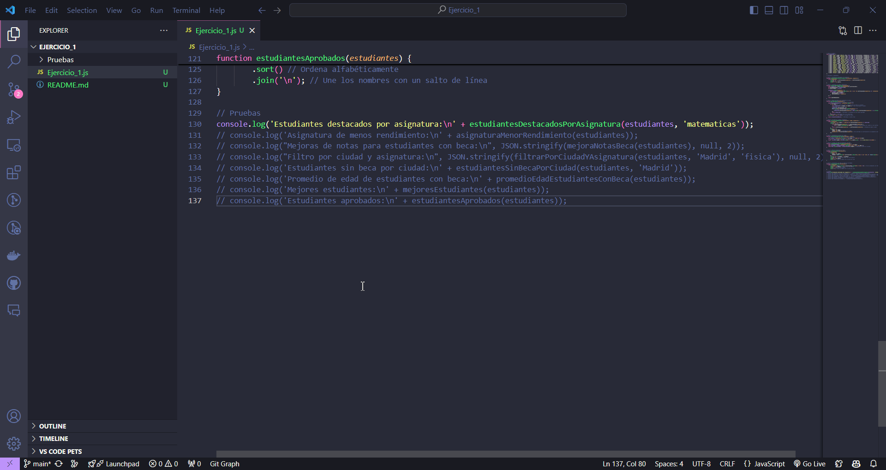
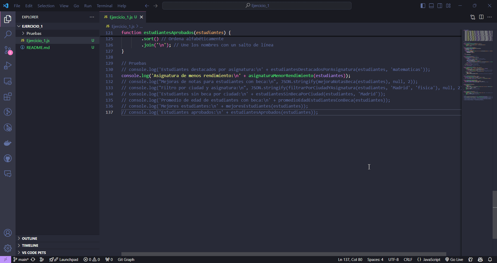
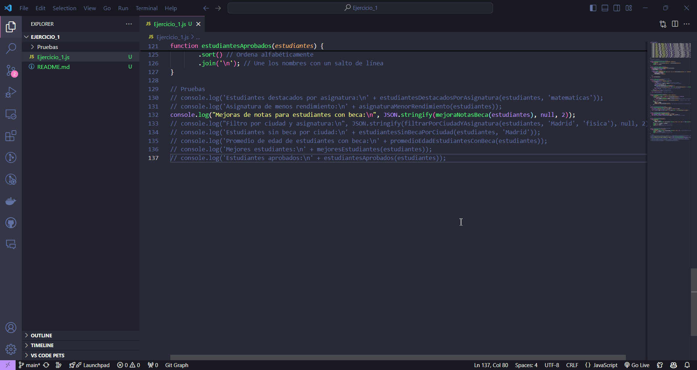
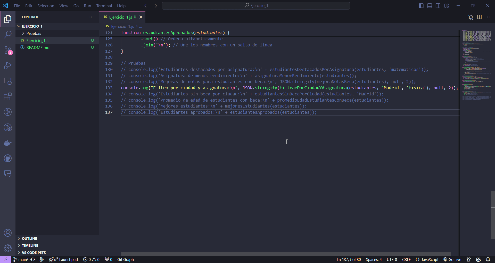
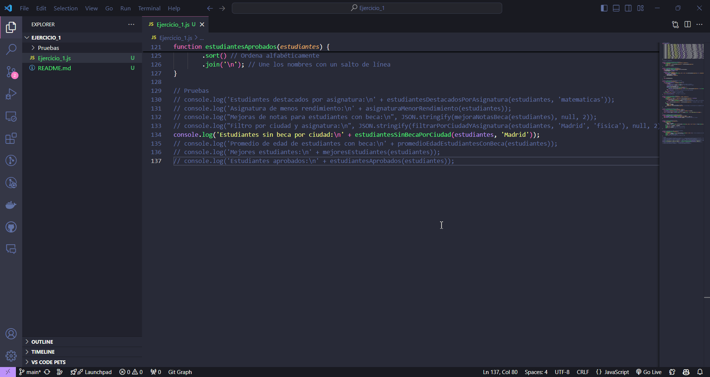
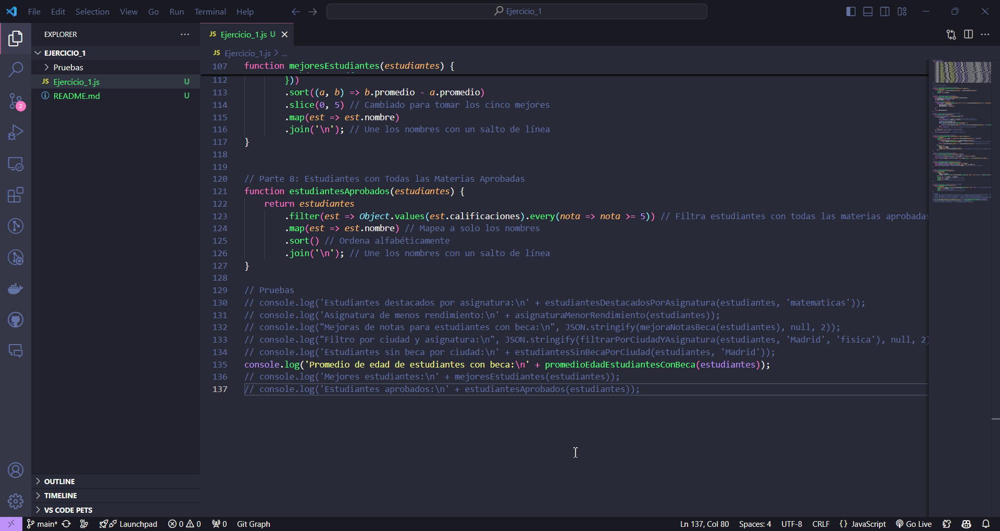
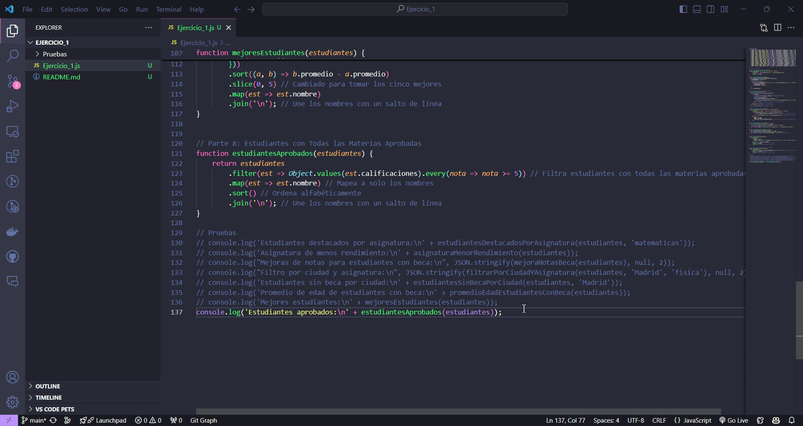

# Ejercicio: Gestión de Estudiantes

## Análisis

**Descripción del ejercicio:**  
Este ejercicio consiste en gestionar un conjunto de estudiantes, permitiendo realizar diversas operaciones como filtrar estudiantes destacados por asignatura, identificar la asignatura con menor rendimiento, mejorar las notas de estudiantes con beca, filtrar estudiantes por ciudad y asignatura, y obtener información sobre estudiantes sin beca. También se incluye la funcionalidad para identificar a los mejores estudiantes y a aquellos que han aprobado todas las materias.

## Diseño

**Descripción de los componentes:**

- **JavaScript (gestorEstudiantes.js):**  
  Este archivo contiene el código que realiza las siguientes funciones:

  - **Datos de Ejemplo:**  
    Se crea un array de objetos que representa a los estudiantes, cada uno con propiedades como nombre, ciudad, beca, edad y calificaciones.

  - **Funciones Implementadas:**

    ### Parte 1: Estudiantes Destacados por Asignatura

    Filtra los tres estudiantes con las mejores calificaciones en una asignatura específica.

    - **Métodos utilizados:**
      - **`sort()`**: Ordena los elementos de un array en función de una función de comparación, en este caso, en base a la calificación en la asignatura especificada (de mayor a menor).
      - **`slice()`**: Toma una parte del array, específicamente los primeros tres elementos (estudiantes) después de haber sido ordenados.
      - **`map()`**: Crea un nuevo array que contiene solo los nombres de los estudiantes destacados.

    **Prueba**  
    

    ### Parte 2: Asignatura con Menor Rendimiento

    Identifica la asignatura en la que los estudiantes tienen un rendimiento promedio más bajo.

    - **Métodos utilizados:**
      - **`Object.keys()`**: Devuelve un array de las claves de un objeto, en este caso, las asignaturas.
      - **`forEach()`**: Itera sobre cada elemento del array de asignaturas para calcular el promedio de cada una.
      - **`reduce()`**: Suma todas las calificaciones para calcular el promedio de cada asignatura.

    **Prueba**  
    

    ### Parte 3: Mejora de Notas para Estudiantes con Beca

    Aumenta las calificaciones de los estudiantes que tienen una beca en un 10%, limitando las notas a un máximo de 10.

    - **Métodos utilizados:**
      - **`map()`**: Crea un nuevo array transformando cada estudiante en uno nuevo, mejorando su calificación si tiene beca.
      - **`Object.keys()`**: Obtiene las claves (asignaturas) de las calificaciones del estudiante.
      - **`forEach()`**: Realiza una acción en cada asignatura, calculando la nueva calificación mejorada.
      - **`Math.min()`**: Asegura que la calificación no supere el 10.
      - **`filter()`**: Filtra el array resultante para eliminar los estudiantes que no tienen beca.

    **Prueba**  
    

    ### Parte 4: Filtrado por Ciudad y Asignatura

    Filtra estudiantes por ciudad y ordena sus calificaciones en una asignatura específica.

    - **Métodos utilizados:**
      - **`filter()`**: Crea un nuevo array que contiene solo a los estudiantes que cumplen con las condiciones de ciudad y asignatura.
      - **`sort()`**: Ordena el array filtrado utilizando una comparación personalizada.
      - **`localeCompare()`**: Compara cadenas de texto según las reglas del idioma, asegurando un ordenamiento correcto de los nombres.
      - **`map()`**: Crea un nuevo array que contiene solo la información relevante (nombre, ciudad y calificación) de cada estudiante.

    **Prueba**  
    

    ### Parte 5: Estudiantes Sin Beca por Ciudad

    Devuelve un mensaje que indica cuántos estudiantes sin beca hay en una ciudad dada.

    - **Métodos utilizados:**
      - **`filter()`**: Filtra a los estudiantes que no tienen beca y que viven en la ciudad especificada.
      - **`map()`**: Crea un nuevo array que contiene solo los nombres de los estudiantes sin beca.
      - **`join()`**: Combina los nombres en una cadena separada por comas.

    **Prueba**  
    

    ### Parte 6: Promedio de Edad de Estudiantes con Beca

    Calcula el promedio de edad de los estudiantes que tienen beca.

    - **Métodos utilizados:**
      - **`filter()`**: Filtra a los estudiantes que tienen beca.
      - **`reduce()`**: Suma las edades de los estudiantes con beca.
      - **`Math.round()`**: Redondea el resultado del promedio al número entero más cercano.

    **Prueba**  
    

    ### Parte 7: Mejores Estudiantes en Total

    Devuelve una lista de los cinco estudiantes con mejores promedios de calificaciones.

    - **Métodos utilizados:**
      - **`map()`**: Crea un nuevo array que contiene el nombre y el promedio de calificaciones de cada estudiante.
      - **`Object.values()`**: Extrae los valores (calificaciones) de las calificaciones de cada estudiante.
      - **`reduce()`**: Suma todas las calificaciones para calcular el promedio.
      - **`sort()`**: Ordena a los estudiantes en función de sus promedios, de mayor a menor.
      - **`slice()`**: Obtiene solo los cinco mejores estudiantes.

    **Prueba**  
    

    ### Parte 8: Estudiantes con Todas las Materias Aprobadas

    Filtra los estudiantes que han aprobado todas sus materias y los ordena alfabéticamente.

    - **Métodos utilizados:**
      - **`filter()`**: Crea un nuevo array que contiene solo los estudiantes que tienen todas las calificaciones por encima de 5.
      - **`Object.values()`**: Obtiene todas las calificaciones del estudiante en forma de array.
      - **`every()`**: Verifica si todos los elementos en el array cumplen con la condición de aprobación.
      - **`map()`**: Transforma el array de estudiantes aprobados en un nuevo array que solo contiene sus nombres.
      - **`sort()`**: Ordena los nombres de los estudiantes alfabéticamente.
      - **`join()`**: Combina todos los nombres en un solo string, separándolos con saltos de línea.

    **Prueba**  
    

**Bibliografía general usada para hacer el ejercicio:**  
Todo el contenido del JavaScript ha sido desarrollado con la asistencia de ChatGPT.

- Copy/Paste directo del ejercicio
- Quiero hacer las pruebas en consola, no me hace falta un HTML
- Arregla entonces la funcion 3 para que funcione
- Vale, hemos avanzado, pero me esta dando demasiados numeros (te doy un ejemplo de lo que me esta dando)
- Okey, va perfecto, Ahora vayamos a un error en la funciona de filtro por ciudad y asignatura, me da este resultado
- Perfecto, ahora estan ordenados, pero quiero que cuando lo printee en consola solo se vean los nombres y la asignatura
- Repite ese codigo pero quita ese ultimo const que usas para el console log, lo quiero limpio
- Genial, funciona, añade la ciudad tambien
- Funciona. Ahora arregla la función 5 para que me de el resultado de esta manera:
- Arregla este .md:
