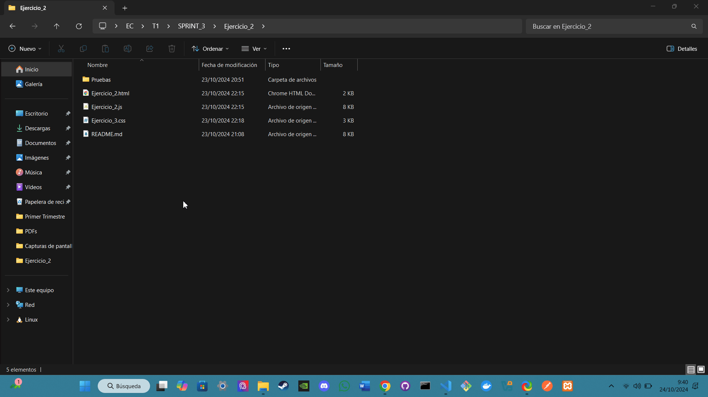
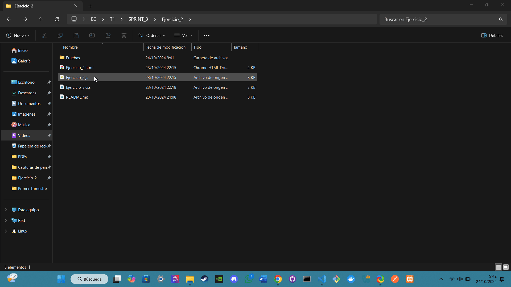
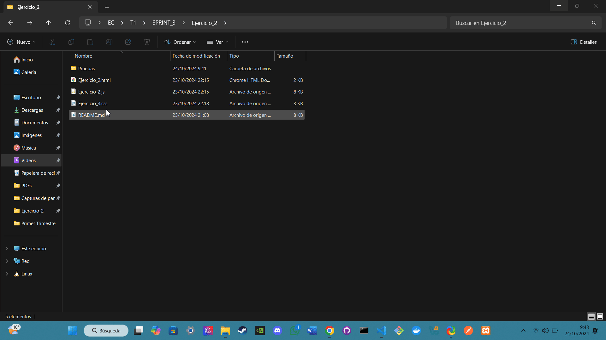

# Ejercicio: PokeAPI

## Análisis

**Descripción del ejercicio:**  
Este ejercicio consiste en implementar diversas funciones para interactuar con la PokeAPI, obteniendo información detallada de Pokémon, comparando estadísticas entre dos Pokémon y mostrando la cadena evolutiva junto a las habilidades de un Pokémon. Las funciones están diseñadas para actualizar el DOM dinámicamente y proporcionar al usuario una experiencia interactiva al buscar información de los Pokémon.

## Diseño

**Descripción de los componentes:**

- **JavaScript (pokeapi.js):**  
  Este archivo contiene el código que realiza las siguientes funciones:

  - **Funciones Implementadas:**

    ### Parte 1: Obtener Información Básica de un Pokémon

    Muestra la información básica de un Pokémon, incluyendo su nombre, ID, tipos y una imagen.

    - **Métodos utilizados:**
      - **`fetch()`**: Se utiliza para realizar solicitudes a la PokeAPI y obtener información en formato JSON sobre un Pokémon.
      - **`try...catch`**: Maneja los errores si no se encuentra al Pokémon o si falla la solicitud.
      - **`map()`**: Genera una lista con los tipos de un Pokémon.

    **Prueba**  
    

    ---

    ### Parte 2: Comparar Estadísticas de Dos Pokémon

    Compara las estadísticas de dos Pokémon y muestra una tabla con sus atributos, destacando el mejor en general.

    - **Métodos utilizados:**
      - **`fetch()`**: Realiza múltiples solicitudes a la PokeAPI para obtener las estadísticas de ambos Pokémon.
      - **`reduce()`**: Suma todas las estadísticas de cada Pokémon para determinar cuál es el mejor en general.
      - **`table`**: Se crea una tabla en HTML para visualizar la comparación de estadísticas.

    **Prueba**  
    

    ---

    ### Parte 3: Obtener Cadena Evolutiva y Habilidades de un Pokémon

    Muestra la cadena evolutiva de un Pokémon sin guiones y una lista de habilidades con la opción de ver la descripción de cada habilidad.

    - **Métodos utilizados:**
      - **`fetch()`**: Se utiliza varias veces para obtener información sobre la especie del Pokémon, la cadena evolutiva y sus habilidades.
      - **`join()`**: Convierte la cadena evolutiva en un formato legible sin guiones entre los nombres.
      - **`map()`**: Lista todas las habilidades del Pokémon, cada una con un botón para mostrar la descripción.

    **Prueba**  
    

    ---

**Bibliografía general usada para hacer el ejercicio:**  
Todo el contenido del JavaScript ha sido desarrollado con la asistencia de ChatGPT.

- Copy/Paste directo del ejercicio
- El css es muy feo, cambialo
- Me gusta el diseño, pero veo ciertos fallos:
En la comparativa de pokemon no me das ni el ataque ni la defensa especial. Ademas quiero que me digas que pokemon es mejor.
En la cadena evolutiva no me gusta como quedan los guiones que hay entre un pokemon y otro, ponlo mejor y mas profesional
- Damelo todo como un unico JS, no te dejes nada
- Ahora no me funciona el HTML
- Cuando inicio el html me da la informacion de algunas cosas que ni siquiera he consultado, haz que cuando lo habra todo este en blanco hasta que yo escirba o busque algo
- Funciona, pero ahora ocurren ciertas cosas:
Cuando comparo 2 pokemon solo me estas dando su ataque especial y su defensa especial, quiero TODAS las estadeisticas junto a a que pokemon es el mejor.
En las evoluciones y habilidades, añade un boton que me permita ver una descripcion de la habilidad
