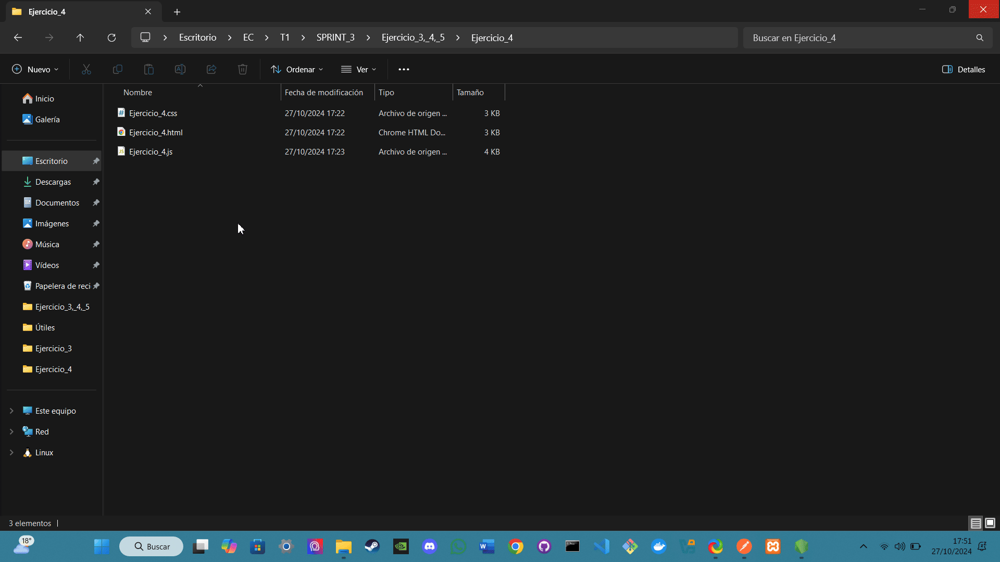

# Ejercicio 3: Gestión de Miembros

## Análisis

**Descripción del ejercicio:**  
Este ejercicio consiste en implementar un sistema para gestionar miembros de una guilda. A través de un formulario, los usuarios pueden añadir, editar y eliminar miembros, así como visualizar una tabla con la información de cada miembro. El sistema utiliza una API para almacenar y recuperar datos de miembros, proporcionando una experiencia interactiva y dinámica al usuario.

## Diseño

**Descripción de los componentes:**

- **JavaScript (Ejercicio_3.js):**  
  Este archivo contiene el código que realiza las siguientes funciones:

  - **Funciones Implementadas:**

    ### Parte 1: Abrir y Cerrar el Modal

    Permite abrir un modal para añadir o editar miembros y cerrarlo.

    - **Métodos utilizados:**
      - **`addEventListener()`**: Escucha el clic en el botón para abrir el modal.
      - **`reset()`**: Resetea el formulario al abrir el modal.
      - **Manipulación del DOM**: Cambia el contenido del modal basado en si se está editando un miembro o añadiendo uno nuevo.

    ---

    ### Parte 2: Añadir y Editar Miembros

    Permite añadir un nuevo miembro o editar uno existente a través de un formulario.

    - **Métodos utilizados:**
      - **`fetch()`**: Realiza solicitudes a la API para añadir o editar miembros.
      - **`JSON.stringify()`**: Convierte los datos del miembro en formato JSON antes de enviarlos.
      - **`try...catch`**: Maneja errores al intentar añadir o editar miembros.

    ---

    ### Parte 3: Eliminar Miembros

    Permite eliminar un miembro de la guilda después de confirmar la acción.

    - **Métodos utilizados:**
      - **`fetch()`**: Envía una solicitud DELETE a la API para eliminar un miembro.
      - **`confirm()`**: Pide confirmación al usuario antes de proceder con la eliminación.

    ---

    ### Parte 4: Obtener y Renderizar Miembros

    Obtiene la lista de miembros desde la API y la muestra en una tabla.

    - **Métodos utilizados:**
      - **`fetch()`**: Recupera la lista de miembros de la API.
      - **Manipulación del DOM**: Crea filas en una tabla HTML para mostrar la información de cada miembro.

## Pruebas a Realizar

### Prueba 1: Visualización de Miembros

- **Pasos:**
  1. Abre la pantalla de gestión de miembros.
  2. Verifica que la tabla lista correctamente a los miembros con todos los campos mencionados.
- **GIF:**
  

### Prueba 2: Añadir Nuevo Miembro

- **Pasos:**
  1. Haz clic en el botón "Add New Member".
  2. Llena el formulario con datos válidos y haz clic en "Add Member".
  3. Verifica que el nuevo miembro se muestra en la tabla y que los datos se han guardado correctamente en la API.
- **GIF:**
  

### Prueba 3: Valoraciones erróneas de Añadir Miembro

- **Pasos:**
  1. Intenta añadir un miembro dejando el campo email vacío o con un formato no válido. Debe mostrar un error.
  2. Intenta añadir un miembro con un `user_id` que ya existe. Debe mostrar un error indicando que el `user_id` es único.
- **GIF:**
  

### Prueba 4: Editar Miembro

- **Pasos:**
  1. Haz clic en "Edit" para un miembro específico.
  2. Modifica los datos del miembro (por ejemplo, cambia el `level` y el `ilvl`).
  3. Guarda los cambios y verifica que se actualizan en la tabla y en la API.
- **GIF:**
  

### Prueba 5: Eliminar Miembro

- **Pasos:**
  1. Haz clic en "Delete" para un miembro específico.
  2. Confirma la acción de eliminación.
  3. Verifica que el miembro se ha eliminado de la tabla y de la API.
- **GIF:**
  

### Prueba 6: Comportamiento del Modal

- **Pasos:**
  1. Abre el modal para añadir un miembro y cierra el modal sin realizar ninguna acción. Verifica que los campos del formulario se limpian correctamente al reabrir el modal.
  2. Haz clic en "Edit" para un miembro, edita algunos campos, y cierra el modal sin guardar. Verifica que los cambios no se guardan y los datos del miembro no se han modificado.
- **GIF:**
  

**Bibliografía general usada para hacer el ejercicio:**  
Todo el contenido del JavaScript ha sido desarrollado con la asistencia de ChatGPT.

- Te voy  pasar el YML de una API:
- Son varias lineas, te paso la siguiente parte (te pasare parte a parte hasta acabar):
- Te doy el final de la API:
- Teniendo en mente toda la API que te acabo de dar, debes hacer el siguiente ejercicio dandome un .js, un .html y un .css: (copy/paste del ejercicio 3)
- Te voy a dar ahora una serie de pruebas que debe pasar (las hare yo mismo, pero tu debes tenerlas en cuenta a la hora de escribir el codigo):
- No funciona como debería, quiero que cuando inicie la pagina me de la lista de miembros que YA estan creados haciendo conexión con mi base de datos.
- Perfecto, me va. Voy a revisar todo el .js que me has enviado y te digo si hay que revisar o cambiar algo
- Vale, te digo los cambios que debes hacer (si ves necesario cambiar el html y css tambien, hazlo):
- Cuando le doy al boton de crear nuevos miembros, crea un selector en las zonas que te voy a indicar con los campos que tambien te voy a indicar (de la misma forma que has hecho en Character Role y en Guild Role):
main_archetype (enum: BARD, CLERIC, FIGHTER, MAGE, RANGER, ROGUE, SUMMONER, TANK)
secondary_archetype (enum: BARD, CLERIC, FIGHTER, MAGE, RANGER, ROGUE, SUMMONER, TANK)
grandmaster_profession_one (enum: FISHING, HERBALISM, HUNTING, LUMBERJACKING, MINING, ALCHEMY, ANIMALHUSBANDRY, COOKING, FARMING, LUMBERMILLING, METALWORKING, STONECUTTING, TANNING, WEAVING, ARCANEENGINEERING, ARMORSMITHING, CARPENTRY, JEWELCUTTING, LEATHERWORKING, SCRIBE, TAILORING, WEAPONSMITHING)
grandmaster_profession_two (enum: FISHING, HERBALISM, HUNTING, LUMBERJACKING, MINING, ALCHEMY, ANIMALHUSBANDRY, COOKING, FARMING, LUMBERMILLING, METALWORKING, STONECUTTING, TANNING, WEAVING, ARCANEENGINEERING, ARMORSMITHING, CARPENTRY, JEWELCUTTING, LEATHERWORKING, SCRIBE, TAILORING, WEAPONSMITHING)
- Repitelo dandome el contenido completo de todos los archivos, no solo lo que has actualizado
- Repitelo todo una vez mas teniendo en cuenta que ruta de la API es <http://localhost:3000/guildmembers>
- El js no me recoge bien los datos a la hora de crear un miembro:
- Actualiza el codigo para que funcione y me recoja los datos
- Me coge los usuarios creados ateriormente, pero me sigue dando undefined cuando creo otro en todos los campos, ademas ya te he dicho que hay campos que deben mantener un selector a la hora de crear un mienbro:
- Haz el js teniendo en cuenta que la URL de conexion a la API es <http://localhost:3000/guildmembers>
- En base a los datos de esta API hazme el siguiente ejercicio dándome un html, css y js usando la conexión que te proporciona la API:
- Las funciones de añadir miembro y de editar mienbri no funcionan en lo absoluto
- La funcion de editar mienro la funciona, pero la de añadir mienbro sigue sin hacer nada
- Sigue sin hacer nada, cuando clico en añadir un nuevo miebro deberia ocurrir algo parecido a cuando edito uno que ya existe, deberia aparecer un baner que me permita añadir datos de ese nuevo mienbro
- Necesito que hagas pequeños cambios manteniendo este codigo que funciona en las funciones CRUD, estos cambios serian:

- En el baner desplegable de añadir un nuevo mienbro, deberian aparecer las asiguientes opciones: user_id (string)
username (string)
level (integer)
ilvl (integer)
character_role (enum: TANK, HEALER, DAMAGE, SUPPORT)
guild_role (enum: LIDER, GERENTE SENIOR, GERENTE, GERENTE A2, ALPHA 2, MEMBER)
main_archetype (enum: BARD, CLERIC, FIGHTER, MAGE, RANGER, ROGUE, SUMMONER, TANK)
secondary_archetype (enum: BARD, CLERIC, FIGHTER, MAGE, RANGER, ROGUE, SUMMONER, TANK)
grandmaster_profession_one (enum: FISHING, HERBALISM, HUNTING, LUMBERJACKING, MINING, ALCHEMY, ANIMALHUSBANDRY, COOKING, FARMING, LUMBERMILLING, METALWORKING, STONECUTTING, TANNING, WEAVING, ARCANEENGINEERING, ARMORSMITHING, CARPENTRY, JEWELCUTTING, LEATHERWORKING, SCRIBE, TAILORING, WEAPONSMITHING)
grandmaster_profession_two (enum: FISHING, HERBALISM, HUNTING, LUMBERJACKING, MINING, ALCHEMY, ANIMALHUSBANDRY, COOKING, FARMING, LUMBERMILLING, METALWORKING, STONECUTTING, TANNING, WEAVING, ARCANEENGINEERING, ARMORSMITHING, CARPENTRY, JEWELCUTTING, LEATHERWORKING, SCRIBE, TAILORING, WEAPONSMITHING)
email (string)
notify_email (boolean)
- Aplica la misma logica al baner de editar mienbro.

---

# Ejercicio 4: Gestión de Parties

## Análisis

**Descripción del ejercicio:**  
Este ejercicio consiste en implementar un sistema para gestionar la creación de "parties". A través de un formulario, los usuarios pueden crear nuevas parties y se valida la información ingresada, incluyendo campos obligatorios y formatos de fecha. El sistema utiliza una API para almacenar y recuperar datos de las parties, proporcionando una experiencia interactiva y dinámica al usuario.

## Diseño

**Descripción de los componentes:**

- **JavaScript (Ejercicio_4.js):**  
  Este archivo contiene el código que realiza las siguientes funciones:

  - **Funciones Implementadas:**

    ### Parte 1: Envío del Formulario

    Permite enviar el formulario para crear una nueva party, validando la información ingresada.

    - **Métodos utilizados:**
      - **`addEventListener()`**: Escucha el evento de envío del formulario.
      - **`preventDefault()`**: Evita el envío del formulario por defecto para manejar la lógica de validación y envío.
      - **`fetch()`**: Realiza solicitudes a la API para crear una nueva party.
      - **`JSON.stringify()`**: Convierte los datos de la party en formato JSON antes de enviarlos.
      - **`try...catch`**: Maneja errores al intentar crear una party.

    ---

    ### Parte 2: Validación de Campos

    Valida los campos del formulario antes de enviar la solicitud a la API.

    - **Validaciones Implementadas:**
      - Verifica que todos los campos obligatorios estén llenos.
      - Comprueba que la fecha ingresada esté en el formato correcto.
      - Asegura que la fecha y hora sean futuras.
      - Verifica que los valores de Level Cap e Item Level Cap sean positivos.

    ---

    ### Parte 3: Cierre del Formulario

    Permite cerrar el formulario y resetear los campos.

    - **Métodos utilizados:**
      - **`reset()`**: Limpia los campos del formulario.
      - **Manipulación del DOM**: Limpia los mensajes de error y éxito al cerrar el formulario.

## Pruebas a Realizar

### Prueba 1: Crear una Party Correctamente

- **Pasos:**
  1. Llena todos los campos del formulario con datos válidos, incluyendo un Planned Start con una fecha y hora futuras.
  2. Envía el formulario.
  3. Verifica que la party se ha creado correctamente y que aparece en la lista de parties.
  
- **GIF:**
  

---

### Prueba 2: Validación de Campos Vacíos

- **Pasos:**
  1. Intenta enviar el formulario dejando algunos de los campos obligatorios vacíos.
  2. **Resultado esperado:** El sistema debe evitar la creación de la party y mostrar un mensaje de error indicando que los campos son obligatorios.
  
- **GIF:**
  

---

### Prueba 3: Validación de Fecha Inválida

- **Pasos:**
  1. Intenta ingresar una fecha en el pasado en el campo Planned Start.
  2. **Resultado esperado:** El sistema debe evitar la creación de la party y mostrar un mensaje de error indicando que la fecha y hora deben ser futuras.
  
- **GIF:**
  

---

### Prueba 4: Validación de Números Negativos en Caps

- **Pasos:**
  1. Ingresa números negativos o cero en los campos Level Cap o Item Level Cap.
  2. **Resultado esperado:** El sistema debe evitar la creación de la party y mostrar un mensaje de error indicando que los valores deben ser positivos.
  
- **GIF:**
  

---

### Prueba 5: Comportamiento del Formulario

- **Pasos:**
  1. Abre el formulario para crear una party, ingresa datos en algunos campos y cierra el formulario sin enviarlo.
  2. Reabre el formulario y verifica que los campos están limpios.
  3. **Resultado esperado:** Los campos deben estar vacíos cuando se vuelve a abrir el formulario.
  
- **GIF:**
  

---

**Bibliografía general usada para hacer el ejercicio:**  
Todo el contenido del JavaScript ha sido desarrollado con la asistencia de ChatGPT.

- Con la misma API que te he dadod (te la vuelvo a proporcionar) haz el siguiente ejercicio proporcionandome tambien un js, html y css: (copy/paste del ejercicio 4)
- En base al archivo .yml de la API que te avabo de dar, debes hacer un .js, un .html y un .css del siguiente ejercicio. Debes tener en cuenta que ya tengo la base de datos exportada a mi localhost y que las rutas URL de conexion con la api son:
- Para obtener todos los detalles de una party: <http://localhost:3000/partyfinder/:partySize/:party_id>
- Para eliminar una party: <http://localhost:3000/partyfinder/:partySize/:party_id>
- Para crear una party: <http://localhost:3000/partyfinder/:partySize>
- en el campo d ela fecha estoy poniendo un campo valido pero me lo da como invalido con un mensaje
- Le estoy dando de fecha 27/01/1999_19:40 y me dice que no es un formato adecuado
- Le estoy dando como fecha 27/11/2024_20:43 y me dice "utiliza un formato que coincida con el solicitado"
- ME DA EL MISMO ERROR
- Le estoy dando la fecha 06/12/2025 02:10 y abajo me sale el error Error: creator_id, party_role_creator y planned_start son obligatorios. Revisa el yml.
- Vuelve a darme todo el codigo, no hace lo que debe, cambia los campos, mejora el css y añade una seccion donde me deben salir las parties ya creadas. Recuerda que las rutas URL para la conexion con la API son:
- Para obtener detalles de una party <http://localhost:3000/partyfinder/:partySize/:party_id>
- Para crear una party <http://localhost:3000/partyfinder/:partySize>
- Funciona, pero necesito que hagas unos ajustes:
- Primero, el sistema de fecha que debe obligar a escribir es DD/MM/YYYY_HH:mm.
- Luego, necesito que verifiques si puedes darme el party_id de la party creada tras hacerlo, si no puedes integrarlo no te preocupes, no es necesario pero me gustaria saberlo.
- Haz que el formulario tenga la capacidad de cerrarse y, en caso de que se cierra y se abra nuevamente, los campos esten vacios todos.
- Mantenlo y quita la parte en la que deberian aparecer las parties debajo del formulario

---

# Ejercicio 5: Gestión de Party

## Análisis

**Descripción del ejercicio:**  
Este ejercicio tiene como objetivo implementar un sistema para gestionar parties en una guilda, utilizando una API para añadir, buscar y eliminar miembros de cada party. A través de un formulario de búsqueda, el usuario puede especificar los parámetros `party_id` y `partySize` para localizar una party en particular y gestionar su lista de miembros mediante botones para añadir o eliminar miembros.

## Diseño

**Descripción de los componentes:**

- **JavaScript (party_management.js):**  
  Este archivo contiene el código JavaScript que gestiona las siguientes funciones:

  - **Funciones Implementadas:**

    ### Parte 1: Búsqueda de una Party

    Permite buscar una party específica mediante `party_id` y `partySize`.

    - **Métodos utilizados:**
      - **`fetch()`**: Realiza una solicitud GET a la API para obtener los datos de la party.
      - **Manipulación del DOM**: Crea un elemento `div` para mostrar la información de la party y sus miembros.
      - **`try...catch`**: Maneja errores en la solicitud de búsqueda, mostrando un mensaje en caso de fallo.

    ---

    ### Parte 2: Mostrar Mensajes de Error o Éxito

    Muestra mensajes de éxito o error según el resultado de las operaciones realizadas en el sistema.

    - **Métodos utilizados:**
      - **Manipulación del DOM**: Cambia el texto y el color de un `div` de mensajes para mostrar el resultado de las operaciones al usuario.

    ---

    ### Parte 3: Añadir Miembro a la Party

    Permite añadir un miembro a una party específica a través de un modal, capturando el `user_id` y `role` del nuevo miembro.

    - **Métodos utilizados:**
      - **`fetch()`**: Realiza una solicitud POST a la API para añadir un nuevo miembro.
      - **`try...catch`**: Maneja errores en la operación de añadir miembro, mostrando mensajes según el estado de la solicitud.
      - **Manipulación del DOM**: Abre y cierra el modal para añadir miembro, y reinicia el formulario tras la operación.

    ---

    ### Parte 4: Cerrar el Modal

    Permite cerrar el modal de añadir miembro.

    - **Métodos utilizados:**
      - **`addEventListener()`**: Escucha el evento de clic para cerrar el modal.

    ---

    ### Parte 5: Eliminar Miembro de la Party

    Permite eliminar un miembro específico de una party.

    - **Métodos utilizados:**
      - **`fetch()`**: Realiza una solicitud POST a la API para eliminar un miembro de la party.
      - **`try...catch`**: Maneja errores al intentar eliminar un miembro, mostrando mensajes de éxito o error.

    ---

    ### Parte 6: Búsqueda de Party a través del Formulario

    Configura el formulario de búsqueda para obtener una party usando los valores introducidos por el usuario.

    - **Métodos utilizados:**
      - **`addEventListener()`**: Escucha el evento de envío del formulario y llama a la función de búsqueda de party.

## Pruebas a Realizar

### Prueba 1: Visualización de Parties Creadas

- **Pasos:**
  1. Abre la pantalla de gestión de parties.
  2. Verifica que todas las parties creadas se muestran correctamente con los datos necesarios.
- **Resultado esperado:**  
  Todas las parties deben listarse con su información básica (ID, creador, fecha de inicio, caps, número de miembros).
- **GIF:**
  

### Prueba 2: Añadir Miembro a una Party

- **Pasos:**
  1. Selecciona una party y añade un nuevo miembro utilizando el modal.
  2. Llena los campos obligatorios y asegúrate de que el rol asignado esté disponible.
- **Resultado esperado:**  
  El miembro se añade exitosamente a la party y el número de miembros se actualiza.
- **GIF:**
  

### Prueba 3: Validación de Roles al Añadir Miembro

- **Pasos:**
  1. Intenta añadir un miembro con un rol que ya está cubierto en la party.
- **Resultado esperado:**  
  El sistema debe evitar la adición del miembro y mostrar un mensaje de error indicando que el rol ya está ocupado.
- **GIF:**
  

### Prueba 4: Remover Miembro de una Party

- **Pasos:**
  1. Selecciona una party y remueve a un miembro existente utilizando el botón "Remove Member".
- **Resultado esperado:**  
  El miembro es removido de la party y el número de miembros se actualiza.
- **GIF:**
  

### Prueba 5: Intentar Añadir Más Miembros del Límite de la Party

- **Pasos:**
  1. Intenta añadir más miembros de los permitidos por el Party Size.
- **Resultado esperado:**  
  El sistema debe evitar la adición de nuevos miembros y mostrar un mensaje de error indicando que la party está llena.
- **GIF:**
  

**Bibliografía general usada para hacer el ejercicio:**  
Todo el código JavaScript ha sido desarrollado con la asistencia de ChatGPT.

- Vamos a hacer el siguiente ejercicio:(copy/paste del ejercicio) Te doy el archivo .yml para que busques los endpoints necesarios para hacer esa parte y el js para que lo analices, pero no toques lo que esta ya hecho sobre visualización de partys, solo añade o edita lo necesario para añadir miembros:
- Has tocado algo de la parte de visualizar partys porque ahora cuando busco una me sale esto:
Error: Cannot read properties of undefined (reading 'length')
- Dame el codigo entero resuleto
- Vale ahora me da de nuevo los datos de la party, pero cuando intento meter un mienbro me pone esto: Error al añadir miembro: La party está llena o no hay posiciones disponibles para el rol especificado.
- Por ejemplo, en la party con size 3 y id 12, tengo estos datos:

{
    "party_id": 12,
    "creator_id": "001",
    "level_cap": 0,
    "ilvl_cap": 0,
    "forum_thread_id": "<'string'>",
    "planned_start": "Invalid date",
    "updated_at": "2024-10-26 21:03:00",
    "party_members": [
        {
            "role": "HEALER",
            "user_id": "001",
            "username": "HealingHarmony"
        },
        {
            "role": null,
            "user_id": null,
            "username": null
        },
        {
            "role": null,
            "user_id": null,
            "username": null
        }
    ],
    "tableName": "partyfinderthree"
}

Podría meter ahí a este miembro?:

 {
        "user_id": "011",
        "username": "Ejemplo",
        "email": "",
        "level": 110,
        "ilvl": 150,
        "character_role": "HEALER",
        "guild_role": "GERENTE SENIOR",
        "joined_guild_at": "2024-10-28T08:03:21.000Z",
        "last_active": "2024-10-28T08:03:21.000Z",
        "main_archetype": "BARD",
        "secondary_archetype": "CLERIC",
        "grandmaster_profession_one": "ALCHEMY",
        "grandmaster_profession_two": "HERBALISM",
        "DKP_1": null,
        "DKP_2": null,
        "notify_partyfinder": 1,
        "notify_dkp": 1,
        "notify_email": 1
    }
- Vale pues estoy intentando añadir a :

 {
        "user_id": "010",
        "username": "Ejemplo 2 de jesus",
        "email": "",
        "level": 110,
        "ilvl": 323,
        "character_role": "TANK",
        "guild_role": "LIDER",
        "joined_guild_at": "2024-10-27T17:15:07.000Z",
        "last_active": "2024-10-27T17:15:07.000Z",
        "main_archetype": "BARD",
        "secondary_archetype": "BARD",
        "grandmaster_profession_one": "FISHING",
        "grandmaster_profession_two": "FISHING",
        "DKP_1": 0,
        "DKP_2": 0,
        "notify_partyfinder": 1,
        "notify_dkp": 1,
        "notify_email": 1
    }

y me da el mismo fallo
