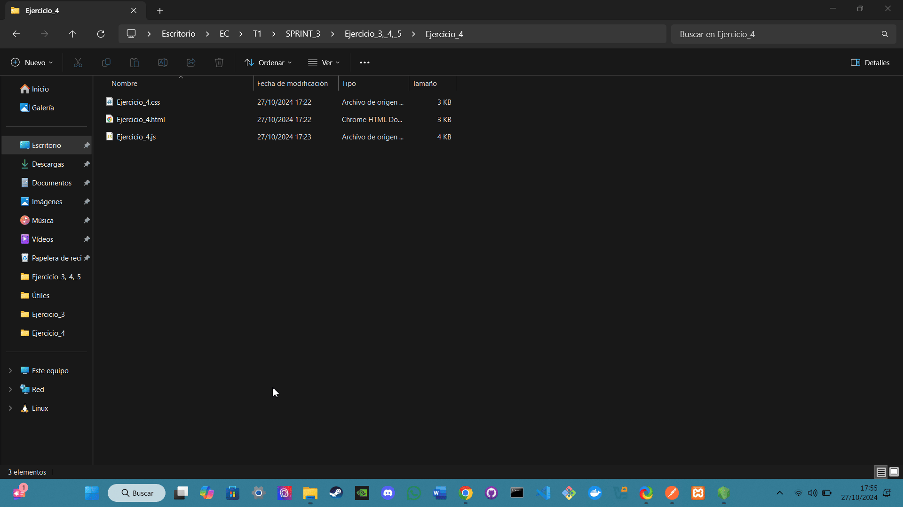

# Ejercicio 3: Gestión de Miembros

## Análisis

**Descripción del ejercicio:**  
Este ejercicio consiste en implementar un sistema para gestionar miembros de una guilda. A través de un formulario, los usuarios pueden añadir, editar y eliminar miembros, así como visualizar una tabla con la información de cada miembro. El sistema utiliza una API para almacenar y recuperar datos de miembros, proporcionando una experiencia interactiva y dinámica al usuario.

## Diseño

**Descripción de los componentes:**

- **JavaScript (Ejercicio_3.js):**  
  Este archivo contiene el código que realiza las siguientes funciones:

  - **Funciones Implementadas:**

    ### Parte 1: Abrir y Cerrar el Modal

    Permite abrir un modal para añadir o editar miembros y cerrarlo.

    - **Métodos utilizados:**
      - **`addEventListener()`**: Escucha el clic en el botón para abrir el modal.
      - **`reset()`**: Resetea el formulario al abrir el modal.
      - **Manipulación del DOM**: Cambia el contenido del modal basado en si se está editando un miembro o añadiendo uno nuevo.

    ---

    ### Parte 2: Añadir y Editar Miembros

    Permite añadir un nuevo miembro o editar uno existente a través de un formulario.

    - **Métodos utilizados:**
      - **`fetch()`**: Realiza solicitudes a la API para añadir o editar miembros.
      - **`JSON.stringify()`**: Convierte los datos del miembro en formato JSON antes de enviarlos.
      - **`try...catch`**: Maneja errores al intentar añadir o editar miembros.

    ---

    ### Parte 3: Eliminar Miembros

    Permite eliminar un miembro de la guilda después de confirmar la acción.

    - **Métodos utilizados:**
      - **`fetch()`**: Envía una solicitud DELETE a la API para eliminar un miembro.
      - **`confirm()`**: Pide confirmación al usuario antes de proceder con la eliminación.

    ---

    ### Parte 4: Obtener y Renderizar Miembros

    Obtiene la lista de miembros desde la API y la muestra en una tabla.

    - **Métodos utilizados:**
      - **`fetch()`**: Recupera la lista de miembros de la API.
      - **Manipulación del DOM**: Crea filas en una tabla HTML para mostrar la información de cada miembro.

## Pruebas a Realizar

### Prueba 1: Visualización de Miembros

- **Pasos:**
  1. Abre la pantalla de gestión de miembros.
  2. Verifica que la tabla lista correctamente a los miembros con todos los campos mencionados.
- **GIF:**
  

### Prueba 2: Añadir Nuevo Miembro

- **Pasos:**
  1. Haz clic en el botón "Add New Member".
  2. Llena el formulario con datos válidos y haz clic en "Add Member".
  3. Verifica que el nuevo miembro se muestra en la tabla y que los datos se han guardado correctamente en la API.
- **GIF:**
  

### Prueba 3: Valoraciones erróneas de Añadir Miembro

- **Pasos:**
  1. Intenta añadir un miembro dejando el campo email vacío o con un formato no válido. Debe mostrar un error.
  2. Intenta añadir un miembro con un `user_id` que ya existe. Debe mostrar un error indicando que el `user_id` es único.
- **GIF:**
  

### Prueba 4: Editar Miembro

- **Pasos:**
  1. Haz clic en "Edit" para un miembro específico.
  2. Modifica los datos del miembro (por ejemplo, cambia el `level` y el `ilvl`).
  3. Guarda los cambios y verifica que se actualizan en la tabla y en la API.
- **GIF:**
  

### Prueba 5: Eliminar Miembro

- **Pasos:**
  1. Haz clic en "Delete" para un miembro específico.
  2. Confirma la acción de eliminación.
  3. Verifica que el miembro se ha eliminado de la tabla y de la API.
- **GIF:**
  

### Prueba 6: Comportamiento del Modal

- **Pasos:**
  1. Abre el modal para añadir un miembro y cierra el modal sin realizar ninguna acción. Verifica que los campos del formulario se limpian correctamente al reabrir el modal.
  2. Haz clic en "Edit" para un miembro, edita algunos campos, y cierra el modal sin guardar. Verifica que los cambios no se guardan y los datos del miembro no se han modificado.
- **GIF:**
  

**Bibliografía general usada para hacer el ejercicio:**  
Todo el contenido del JavaScript ha sido desarrollado con la asistencia de ChatGPT.

---

# Ejercicio 4: Gestión de Parties

## Análisis

**Descripción del ejercicio:**  
Este ejercicio consiste en implementar un sistema para gestionar la creación de "parties". A través de un formulario, los usuarios pueden crear nuevas parties y se valida la información ingresada, incluyendo campos obligatorios y formatos de fecha. El sistema utiliza una API para almacenar y recuperar datos de las parties, proporcionando una experiencia interactiva y dinámica al usuario.

## Diseño

**Descripción de los componentes:**

- **JavaScript (Ejercicio_4.js):**  
  Este archivo contiene el código que realiza las siguientes funciones:

  - **Funciones Implementadas:**

    ### Parte 1: Envío del Formulario

    Permite enviar el formulario para crear una nueva party, validando la información ingresada.

    - **Métodos utilizados:**
      - **`addEventListener()`**: Escucha el evento de envío del formulario.
      - **`preventDefault()`**: Evita el envío del formulario por defecto para manejar la lógica de validación y envío.
      - **`fetch()`**: Realiza solicitudes a la API para crear una nueva party.
      - **`JSON.stringify()`**: Convierte los datos de la party en formato JSON antes de enviarlos.
      - **`try...catch`**: Maneja errores al intentar crear una party.

    ---

    ### Parte 2: Validación de Campos

    Valida los campos del formulario antes de enviar la solicitud a la API.

    - **Validaciones Implementadas:**
      - Verifica que todos los campos obligatorios estén llenos.
      - Comprueba que la fecha ingresada esté en el formato correcto.
      - Asegura que la fecha y hora sean futuras.
      - Verifica que los valores de Level Cap e Item Level Cap sean positivos.

    ---

    ### Parte 3: Cierre del Formulario

    Permite cerrar el formulario y resetear los campos.

    - **Métodos utilizados:**
      - **`reset()`**: Limpia los campos del formulario.
      - **Manipulación del DOM**: Limpia los mensajes de error y éxito al cerrar el formulario.

## Pruebas a Realizar

### Prueba 1: Crear una Party Correctamente

- **Pasos:**
  1. Llena todos los campos del formulario con datos válidos, incluyendo un Planned Start con una fecha y hora futuras.
  2. Envía el formulario.
  3. Verifica que la party se ha creado correctamente y que aparece en la lista de parties.
  
- **GIF:**
  

---

### Prueba 2: Validación de Campos Vacíos

- **Pasos:**
  1. Intenta enviar el formulario dejando algunos de los campos obligatorios vacíos.
  2. **Resultado esperado:** El sistema debe evitar la creación de la party y mostrar un mensaje de error indicando que los campos son obligatorios.
  
- **GIF:**
  

---

### Prueba 3: Validación de Fecha Inválida

- **Pasos:**
  1. Intenta ingresar una fecha en el pasado en el campo Planned Start.
  2. **Resultado esperado:** El sistema debe evitar la creación de la party y mostrar un mensaje de error indicando que la fecha y hora deben ser futuras.
  
- **GIF:**
  

---

### Prueba 4: Validación de Números Negativos en Caps

- **Pasos:**
  1. Ingresa números negativos o cero en los campos Level Cap o Item Level Cap.
  2. **Resultado esperado:** El sistema debe evitar la creación de la party y mostrar un mensaje de error indicando que los valores deben ser positivos.
  
- **GIF:**
  

---

### Prueba 5: Comportamiento del Formulario

- **Pasos:**
  1. Abre el formulario para crear una party, ingresa datos en algunos campos y cierra el formulario sin enviarlo.
  2. Reabre el formulario y verifica que los campos están limpios.
  3. **Resultado esperado:** Los campos deben estar vacíos cuando se vuelve a abrir el formulario.
  
- **GIF:**
  

---

**Bibliografía general usada para hacer el ejercicio:**  
Todo el contenido del JavaScript ha sido desarrollado con la asistencia de ChatGPT.
