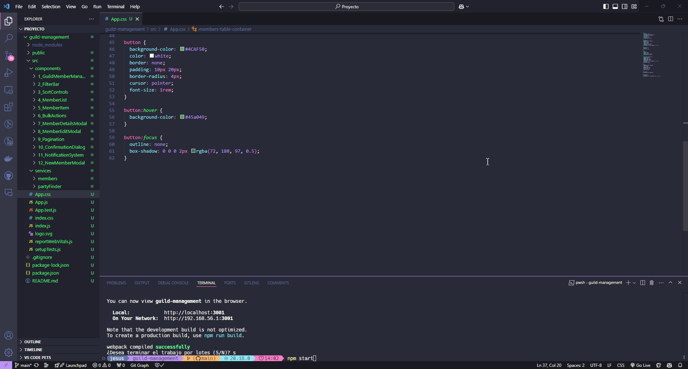
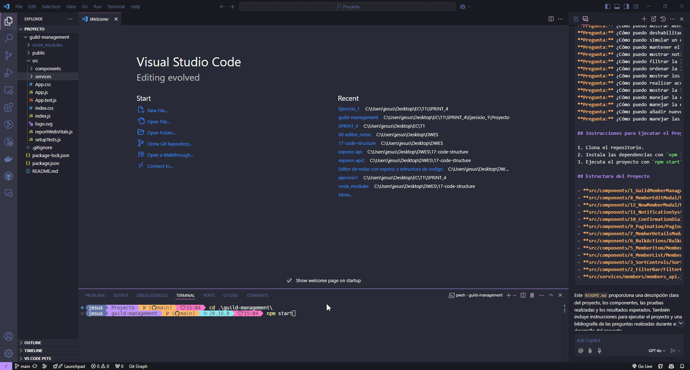
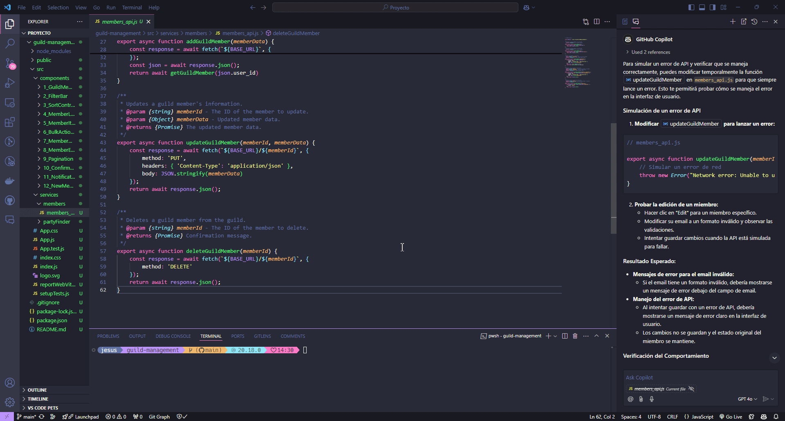
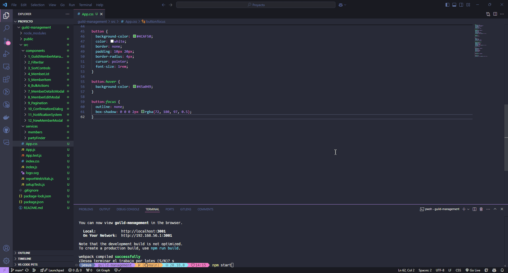

# Proyecto: Gestión de Miembros de una Guild

## Descripción del Proyecto

Este proyecto consiste en gestionar un conjunto de miembros de una guild, permitiendo realizar diversas operaciones como filtrar miembros, editar información, manejar roles y notificaciones, y gestionar errores de API. El proyecto está desarrollado en React y utiliza una API para manejar los datos de los miembros.

## Componentes del Proyecto

### GuildMemberManagement.jsx

Este componente principal gestiona la lista de miembros de la guild y permite realizar operaciones como filtrar, ordenar, editar, eliminar y añadir nuevos miembros.

#### Funciones Implementadas:

- **Filtrado y Ordenación de Miembros:**
  - Permite filtrar miembros por roles, niveles y otras características.
  - Ordena los miembros según diferentes criterios.

- **Edición de Miembros:**
  - Permite editar la información de un miembro específico.
  - Maneja validaciones de datos y errores de API.

- **Eliminación de Miembros:**
  - Permite eliminar miembros de la guild.
  - Muestra confirmaciones antes de eliminar.

- **Añadir Nuevos Miembros:**
  - Permite añadir nuevos miembros a la guild.
  - Maneja validaciones de datos y errores de API.

### MemberEditModal.jsx

Este componente permite editar la información de un miembro específico. Incluye validaciones de datos y manejo de errores de API.

#### Funciones Implementadas:

- **Validación de Datos:**
  - Valida el formato del email.
  - Valida que los niveles y ILvl sean positivos.

- **Manejo de Errores de API:**
  - Muestra mensajes de error claros cuando hay problemas con la API.
  - Mantiene el estado original del miembro si ocurre un error.

### NewMemberModal.jsx

Este componente permite añadir nuevos miembros a la guild. Incluye validaciones de datos y manejo de errores de API.

#### Funciones Implementadas:

- **Validación de Datos:**
  - Valida el formato del email.
  - Valida que los niveles y ILvl sean positivos.
  - Verifica que el User ID no exista ya en la guild.

- **Manejo de Errores de API:**
  - Muestra mensajes de error claros cuando hay problemas con la API.

### NotificationSystem.jsx

Este componente muestra notificaciones en la interfaz de usuario.

#### Funciones Implementadas:

- **Mostrar Notificaciones:**
  - Muestra notificaciones de éxito y error.
  - Permite cerrar las notificaciones manualmente.

### ConfirmationDialog.jsx

Este componente muestra un cuadro de diálogo de confirmación.

#### Funciones Implementadas:

- **Mostrar Cuadro de Diálogo:**
  - Muestra un mensaje de confirmación.
  - Permite confirmar o cancelar la acción.

### Pagination.jsx

Este componente maneja la paginación de la lista de miembros.

#### Funciones Implementadas:

- **Paginación:**
  - Muestra botones de paginación.
  - Permite cambiar de página.

### MemberDetailsModal.jsx

Este componente muestra los detalles de un miembro específico.

#### Funciones Implementadas:

- **Mostrar Detalles del Miembro:**
  - Muestra la información detallada del miembro.
  - Permite cerrar el modal.

### BulkActions.jsx

Este componente permite realizar acciones en masa sobre los miembros seleccionados.

#### Funciones Implementadas:

- **Enviar Mensaje:**
  - Permite enviar un mensaje a los miembros seleccionados.

- **Cambiar Rol de la Guild:**
  - Permite cambiar el rol de la guild de los miembros seleccionados.

### MemberItem.jsx

Este componente muestra la información de un miembro en una fila de la tabla.

#### Funciones Implementadas:

- **Mostrar Información del Miembro:**
  - Muestra la información del miembro en una fila de la tabla.
  - Permite seleccionar, editar y eliminar el miembro.

### MemberList.jsx

Este componente muestra la lista de miembros en una tabla.

#### Funciones Implementadas:

- **Mostrar Lista de Miembros:**
  - Muestra la lista de miembros en una tabla.
  - Permite seleccionar, editar y eliminar miembros.
  - Maneja la paginación de la lista.

### SortControls.jsx

Este componente permite ordenar la lista de miembros por diferentes criterios.

#### Funciones Implementadas:

- **Ordenar Miembros:**
  - Permite ordenar la lista de miembros por diferentes criterios.

### FilterBar.jsx

Este componente permite filtrar la lista de miembros por diferentes criterios.

#### Funciones Implementadas:

- **Filtrar Miembros:**
  - Permite filtrar la lista de miembros por diferentes criterios.

## Pruebas a Realizar

### Prueba 1: Visualización y Filtrado de Miembros

**Acción:**
- Abrir el panel de gestión de miembros.
- Aplicar diferentes filtros (por ejemplo, filtrar por Character Role = TANK y Level >= 50).
- Ordenar la lista por Level de manera descendente.

**Resultado Esperado:**
- La tabla muestra solo los miembros que cumplen con los criterios de filtrado.
- Los miembros se ordenan correctamente según el criterio seleccionado.
- El número total de resultados se actualiza acorde a los filtros aplicados.

**Prueba**  


---

### Prueba 2: Selección Múltiple y Acción en Lote

**Acción:**
- Seleccionar varios miembros utilizando las casillas de verificación.
- Utilizar la casilla en el encabezado para seleccionar todos.
- Aplicar la acción "Cambiar Guild Role" a "MEMBER" para los miembros seleccionados.

**Resultado Esperado:**
- Los miembros seleccionados cambian su Guild Role a "MEMBER".
- Se muestra una notificación de éxito.
- Si algún miembro no puede ser actualizado (por ejemplo, falta de permisos), se muestra un mensaje de error correspondiente.

**Prueba**  


---

### Prueba 3: Añadir Nuevo Miembro con Validaciones

**Acción:**
- Hacer clic en "Add New Member" para abrir el modal.
- Intentar enviar el formulario con campos inválidos (email incorrecto, level negativo).
- Corregir los errores y enviar el formulario con datos válidos.

**Resultado Esperado:**
- Se muestran mensajes de error en tiempo real para los campos inválidos.
- El botón de "Add Member" está deshabilitado hasta que el formulario sea válido.
- Al enviar datos válidos, el nuevo miembro se añade y aparece en la tabla.
- Se muestra una notificación de éxito.

**Prueba**  


---

### Prueba 4: Edición de Miembro y Manejo de Errores de API

**Acción:**
- Hacer clic en "Edit" para un miembro específico.
- Modificar su email a un formato inválido y observar las validaciones.
- Intentar guardar cambios cuando la API está simulada para fallar (por ejemplo, simular un error de red).

**Resultado Esperado:**
- Se muestran mensajes de error para el email inválido.
- Al intentar guardar con un error de API, se muestra un mensaje de error claro.
- Los cambios no se guardan y el estado original del miembro se mantiene.

**Prueba**  


---

### Prueba 5: Eliminación de Miembro con Confirmación

**Acción:**
- Hacer clic en "Delete" para un miembro específico.
- En el diálogo de confirmación, cancelar la acción.
- Volver a intentar y confirmar la eliminación.

**Resultado Esperado:**
- Al cancelar, el miembro sigue presente en la tabla.
- Al confirmar, el miembro se elimina de la tabla y de la base de datos.
- Se muestra una notificación de éxito.

**Prueba**  


## Bibliografía

Todo el contenido del JavaScript ha sido desarrollado con la asistencia de ChatGPT.

**Pregunta:** ¿Cómo puedo validar el formato del email en el formulario de edición?
**Pregunta:** ¿Cómo puedo manejar errores de API y mostrar mensajes de error claros en la interfaz de usuario?
**Pregunta:** ¿Cómo puedo asegurarme de que los nuevos miembros se añadan de manera ordenada en la tabla?
**Pregunta:** ¿Cómo puedo implementar la selección múltiple y las acciones en lote para los miembros?
**Pregunta:** ¿Cómo puedo mostrar un cuadro de diálogo de confirmación antes de eliminar un miembro?
**Pregunta:** ¿Cómo puedo manejar la paginación de la lista de miembros?
**Pregunta:** ¿Cómo puedo mostrar mensajes de error en tiempo real para los campos inválidos en el formulario de nuevo miembro?
**Pregunta:** ¿Cómo puedo deshabilitar el botón de "Add Member" hasta que el formulario sea válido?
**Pregunta:** ¿Cómo puedo simular un error de red en la API para probar el manejo de errores?
**Pregunta:** ¿Cómo puedo mantener el estado original del miembro si ocurre un error al guardar los cambios?
**Pregunta:** ¿Cómo puedo mostrar notificaciones de éxito y error en la interfaz de usuario?
**Pregunta:** ¿Cómo puedo filtrar la lista de miembros por diferentes criterios?
**Pregunta:** ¿Cómo puedo ordenar la lista de miembros por diferentes criterios?
**Pregunta:** ¿Cómo puedo mostrar los detalles de un miembro específico en un modal?
**Pregunta:** ¿Cómo puedo realizar acciones en masa sobre los miembros seleccionados?
**Pregunta:** ¿Cómo puedo mostrar la información de un miembro en una fila de la tabla?
**Pregunta:** ¿Cómo puedo manejar la edición de la información de un miembro específico?
**Pregunta:** ¿Cómo puedo manejar la eliminación de miembros de la guild?
**Pregunta:** ¿Cómo puedo añadir nuevos miembros a la guild?
**Pregunta:** ¿Cómo puedo manejar las validaciones de datos en los formularios?

## Instrucciones para Ejecutar el Proyecto

1. Clona el repositorio.
2. Instala las dependencias con `npm install`.
3. Ejecuta el proyecto con `npm start`.

## Estructura del Proyecto

- **src/components/1_GuildMemberManagement/GuildMemberManagement.jsx:** Componente principal para gestionar los miembros de la guild.
- **src/components/8_MemberEditModal/MemberEditModal.jsx:** Componente para editar la información de un miembro.
- **src/components/12_NewMemberModal/NewMemberModal.jsx:** Componente para añadir nuevos miembros.
- **src/components/11_NotificationSystem/NotificationSystem.jsx:** Componente para mostrar notificaciones.
- **src/components/10_ConfirmationDialog/ConfirmationDialog.jsx:** Componente para mostrar cuadros de diálogo de confirmación.
- **src/components/9_Pagination/Pagination.jsx:** Componente para manejar la paginación.
- **src/components/7_MemberDetailsModal/MemberDetailsModal.jsx:** Componente para mostrar los detalles de un miembro.
- **src/components/6_BulkActions/BulkActions.jsx:** Componente para realizar acciones en masa sobre los miembros seleccionados.
- **src/components/5_MemberItem/MemberItem.jsx:** Componente para mostrar la información de un miembro en una fila de la tabla.
- **src/components/4_MemberList/MemberList.jsx:** Componente para mostrar la lista de miembros en una tabla.
- **src/components/3_SortControls/SortControls.jsx:** Componente para ordenar la lista de miembros por diferentes criterios.
- **src/components/2_FilterBar/FilterBar.jsx:** Componente para filtrar la lista de miembros por diferentes criterios.
- **src/services/members/members_api.js:** Archivo que contiene las funciones para interactuar con la API.

```
.gitignore
package.json
public/
├── index.html
├── manifest.json
└── robots.txt
README.md
src/
├── App.css
├── App.js
├── App.test.js
├── components/
│   ├── 1_GuildMemberManagement/
│   │   ├── GuildMemberManagement.css
│   │   └── GuildMemberManagement.jsx
│   ├── 2_FilterBar/
│   │   ├── FilterBar.css
│   │   └── FilterBar.jsx
│   ├── 3_SortControls/
│   │   ├── SortControls.css
│   │   └── SortControls.jsx
│   ├── 4_MemberList/
│   │   ├── MemberList.css
│   │   └── MemberList.jsx
│   ├── 5_MemberItem/
│   │   ├── MemberItem.css
│   │   └── MemberItem.jsx
│   ├── 6_BulkActions/
│   │   ├── BulkActions.css
│   │   └── BulkActions.jsx
│   ├── 7_MemberDetailsModal/
│   │   ├── MemberDetailsModal.css
│   │   └── MemberDetailsModal.jsx
│   ├── 8_MemberEditModal/
│   │   ├── MemberEditModal.css
│   │   └── MemberEditModal.jsx
│   ├── 9_Pagination/
│   │   ├── Pagination.css
│   │   └── Pagination.jsx
│   ├── 10_ConfirmationDialog/
│   │   ├── ConfirmationDialog.css
│   │   └── ConfirmationDialog.jsx
│   ├── 11_NotificationSystem/
│   │   ├── NotificationSystem.css
│   │   └── NotificationSystem.jsx
│   └── 12_NewMemberModal/
│       ├── NewMemberModal.css
│       └── NewMemberModal.jsx
├── index.css
├── index.js
├── reportWebVitals.js
├── services/
│   ├── members/
│   │   └── members_api.js
│   └── partyFinder/
│       └── partyFinder_api.js
└── setupTests.js
```
---