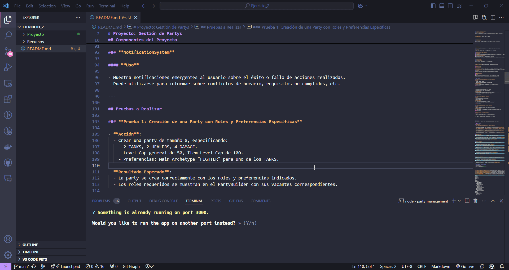

# Proyecto: Gestión de Partys

## Descripción del Proyecto

Este proyecto consiste en gestionar un conjunto de partys, permitiendo realizar diversas operaciones como crear partys, añadir y eliminar miembros, optimizar equipos, validar restricciones y manejar notificaciones. El proyecto está desarrollado en **React** y utiliza una API para manejar los datos de los miembros y las partys.

---

## Componentes del Proyecto

### **PartyBuilder (Componente Principal)**

#### **Estado y Lógica Principal**

- Gestiona el estado de la party, incluyendo los miembros seleccionados, roles requeridos y preferencias.
- Maneja la lógica para añadir, remover y actualizar miembros en la party.

#### **Funciones Principales**

- **handleAddMember**: Añade un miembro a la party, verificando validaciones y restricciones.
- **handleRemoveMember**: Remueve un miembro de la party.
- **optimizeTeam**: Ejecuta la optimización automática utilizando el OptimizationEngine.

---

### **MemberSelector**

#### **Funcionalidad**

- Muestra la lista de guildmembers filtrable por Level, Item Level, Archetype, Profesiones, etc.
- Permite seleccionar un miembro y asignarle un rol disponible.

#### **Interacción**

- Envía el miembro seleccionado al PartyBuilder para su incorporación al equipo.

---

### **TeamRoster**

#### **Visualización**

- Muestra los miembros actuales de la party, su rol asignado y estado respecto a los requisitos.

#### **Acciones**

- Permite remover miembros o cambiar su rol asignado dentro de las restricciones.

---

### **OptimizationEngine (Lógica de Negocio)**

#### **Descripción**

- Algoritmo que procesa la información de los guildmembers y los requisitos de la party para generar una sugerencia óptima.

#### **Consideraciones del Algoritmo**

- Priorizar miembros que cumplen con todas las preferencias y requisitos.
- Manejar casos donde no hay suficientes miembros disponibles que cumplan con todos los criterios, ofreciendo las mejores alternativas posibles.

---

### **OptimizationModal**

#### **Interfaz de Usuario**

- Muestra la lista de miembros sugeridos por el OptimizationEngine.
- Permite al líder revisar cada miembro, ver por qué fueron seleccionados y realizar cambios si es necesario.

#### **Acciones Disponibles**

- **Aceptar Sugerencia**: Añade todos los miembros sugeridos a la party.
- **Modificar Sugerencia**: Permite reemplazar miembros sugeridos por otros disponibles.

---

### **ValidationSystem**

#### **Funciones Clave**

- **validateMember**: Verifica si un miembro cumple con los requisitos y restricciones al ser añadido.
- **validateTeamComposition**: Asegura que la composición del equipo respeta los roles requeridos y limitaciones.

#### **Feedback**

- Proporciona mensajes claros sobre cualquier problema encontrado durante la validación.

---

### **NotificationSystem**

#### **Uso**

- Muestra notificaciones emergentes al usuario sobre el éxito o fallo de acciones realizadas.
- Puede utilizarse para informar sobre conflictos de horario, requisitos no cumplidos, etc.

---

## Pruebas a Realizar

### **Prueba 1: Creación de una Party con Roles y Preferencias Específicas**

- **Acción**:
  - Crear una party de tamaño 8, especificando:
    - 2 TANKS, 2 HEALERS, 4 DAMAGE.
    - Level Cap general de 50, Item Level Cap de 100.
    - Preferencias: Main Archetype "FIGHTER" para uno de los TANKS.

- **Resultado Esperado**:
  - La party se crea correctamente con los roles y preferencias indicados.
  - Los roles requeridos se muestran en el PartyBuilder con sus vacantes correspondientes.



---

### **Prueba 2: Añadir Miembros Manualmente y Validar Restricciones**

- **Acción**:
  - Intentar añadir un miembro que no cumple con el Level Cap.
  - Añadir miembros que cumplen con los requisitos, asignándoles los roles necesarios.
  - Intentar añadir un tercer HEALER cuando el máximo es 2.

- **Resultado Esperado**:
  - El sistema impide añadir miembros que no cumplen con el Level Cap y muestra un mensaje de error.
  - Los miembros válidos se añaden correctamente y los roles se actualizan.
  - No permite añadir más miembros a un rol que ya está completo.


---

### **Prueba 3: Utilizar la Optimización Automática**

- **Acción**:
  - Con roles aún vacantes, hacer clic en "Optimizar Equipo".
  - Revisar las sugerencias en el OptimizationModal.
  - Reemplazar un miembro sugerido por otro manualmente.
  - Aceptar la sugerencia final.

- **Resultado Esperado**:
  - El sistema sugiere miembros que cumplen con los requisitos y preferencias.
  - Es posible ajustar las sugerencias antes de aceptarlas.
  - Los miembros sugeridos se añaden al equipo y los roles se completan.


---

### **Prueba 4: Validar Disponibilidad y Conflictos de Horario**

- **Acción**:
  - Intentar añadir un miembro que está en otra party al mismo tiempo.
  - Cambiar el Planned Start a una fecha pasada y observar el comportamiento.

- **Resultado Esperado**:
  - El sistema impide añadir miembros con conflictos de horario y notifica al usuario.
  - No permite establecer una fecha pasada para el inicio de la party y muestra un mensaje de error.


---

### **Prueba 5: Remover y Reasignar Roles a Miembros**

- **Acción**:
  - Remover un miembro del equipo y observar la actualización de los roles.
  - Cambiar el rol asignado a un miembro dentro de las restricciones.

- **Resultado Esperado**:
  - El miembro es removido correctamente y la vacante en el rol se actualiza.
  - Es posible reasignar roles a los miembros siempre que no excedan las restricciones.


---

# Bibliografía

Todo el contenido del JavaScript ha sido desarrollado con la asistencia de GitHub Copilot.

---

## Preguntas Frecuentes

**Pregunta:** ¿Cómo puedo añadir un miembro a una party?

**Pregunta:** ¿Cómo puedo eliminar un miembro de una party?

**Pregunta:** ¿Cómo puedo obtener los detalles de una party específica?

**Pregunta:** ¿Cómo puedo actualizar la información de un miembro de la guild?

**Pregunta:** ¿Cómo puedo eliminar un miembro de la guild?

**Pregunta:** ¿Cómo puedo optimizar la composición de una party?

**Pregunta:** ¿Cómo puedo mostrar notificaciones en la aplicación?

**Pregunta:** ¿Cómo puedo filtrar miembros por nivel y arquetipo?

**Pregunta:** ¿Cómo puedo crear una nueva party?

**Pregunta:** ¿Cómo puedo manejar la paginación en la lista de miembros?

**Pregunta:** ¿Cómo puedo manejar errores de API y mostrar mensajes de error claros en la interfaz de usuario?

**Pregunta:** ¿Cómo puedo asegurarme de que los nuevos miembros se añadan de manera ordenada en la tabla?

---

## Instrucciones para Ejecutar el Proyecto

1. Clona el repositorio.
2. Instala las dependencias con `npm install`.
3. Ejecuta el proyecto con `npm start`.

---

## Estructura del Proyecto

- **src/components/1_PartyBuilder/PartyBuilder.jsx:** Componente principal para gestionar la creación y administración de partys.
- **src/components/2_MemberSelector/MemberSelector.jsx:** Componente para seleccionar miembros de la guild y asignarlos a una party.
- **src/components/3_TeamRoster/TeamRoster.jsx:** Componente para mostrar la lista de miembros de una party.
- **src/components/4_OptimizationEngine/OptimizationEngine.jsx:** Componente para optimizar la composición de una party.
- **src/components/5_OptimizationModal/OptimizationModal.jsx:** Componente para mostrar las sugerencias de optimización.
- **src/components/6_ValidationSystem/ValidationSystem.jsx:** Componente para validar restricciones y requisitos de los miembros.
- **src/components/7_NotificationSystem/NotificationSystem.jsx:** Componente para mostrar notificaciones.
- **src/services/members/members_api.js:** Archivo que contiene las funciones para interactuar con la API de miembros.
- **src/services/partyFinder/partyFinder_api.js:** Archivo que contiene las funciones para interactuar con la API de party finder.

```plaintext
.gitignore
package.json
public/
├── index.html
├── manifest.json
└── robots.txt
README.md
src/
├── App.css
├── App.js
├── App.test.js
├── components/
│   ├── 1_PartyBuilder/
│   │   ├── PartyBuilder.css
│   │   └── PartyBuilder.jsx
│   ├── 2_MemberSelector/
│   │   ├── MemberSelector.css
│   │   └── MemberSelector.jsx
│   ├── 3_TeamRoster/
│   │   ├── TeamRoster.css
│   │   └── TeamRoster.jsx
│   ├── 4_OptimizationEngine/
│   │   ├── OptimizationEngine.css
│   │   └── OptimizationEngine.jsx
│   ├── 5_OptimizationModal/
│   ├── 6_ValidationSystem/
│   └── 7_NotificationSystem/
│       ├── NotificationSystem.css
│       └── NotificationSystem.jsx
├── index.css
├── index.js
├── reportWebVitals.js
├── services/
│   ├── members/
│   │   └── members_api.js
│   └── partyFinder/
│       └── partyFinder_api.js
└── setupTests.js
```

---
